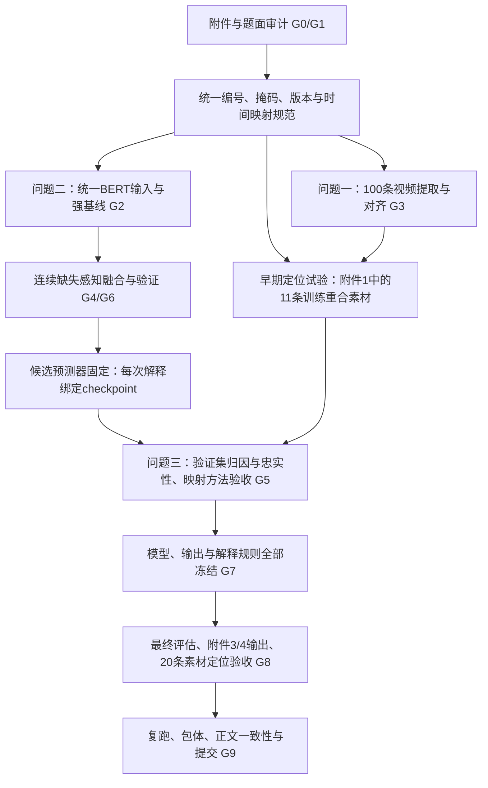

# E题完整解题 Roadmap

> 目标：围绕“连续局部模态缺失下的可靠预测与可核验证据”，完整回答三问，形成可复现、有明确改进证据的一等奖竞争作品。
>
> 版本：v1.1｜日期：2026-09-23｜状态：已完成题面与数据前提复审，正式模型与三问交付尚未完成。
>
> 本文件是执行依据。文中的参数、阈值和工时为团队内部初始方案，不是官方评分标准；方法效果须经实验确认。门禁由数据检查、实验结果和复核记录驱动，通过后继续推进，不需要每一步重新申请许可。
>
> 本次修订说明见 [ROADMAP_REVIEW.md](ROADMAP_REVIEW.md)，原稿保留于 [v1.0备份](roadmap_review/ROADMAP.v1.0.md)。本次仅完成路线审查与数据核查，未新增模型性能结论。

## 0. 决策摘要与当前状态

### 0.1 已确定的主线

1. **默认采用 aligned_50 版本**完成问题二、三，减少接口和时序建模负担。只有主线遇到可证明的瓶颈且时间允许，才启动非对齐分支；不得混用两版训练与专项测试。
2. **先统一 text_bert 输入，再训练正式模型。** 附件3没有预计算 text，因此现有基于768维 text 的成绩只能作为诊断基线或教师参考。
3. **主方案使用小型预训练 BERT＋轻量时序融合。** 候选为2层、128隐藏维的小型BERT；核验词表兼容性后使用。把大模型蒸馏设为可选优化，不将“从零训练词元模型一定有效”作为前提。
4. **一个主要机制：连续缺失结构感知的可靠性融合。** 将三模态缺失结构共同输入可观测模态门控与时间聚合，避免结构信息在缺失位置被掩码直接消去；先做同预算对照和消融。
5. **问题三解释冻结后的真实预测器。** 模态层用精确三模态Shapley，局部用连续窗口遮挡，并映射回原素材；不以注意力热图替代解释验证。
6. **三问并行推进、公共规则共享。** 问题一自提取特征与问题二、三指定特征分开保存；前6小时就试验特征位置到原视频的映射，不把第三问定位难题留到后期。
7. **50MB限制从第一次可运行版本开始验证。** 优先共享模型权重，必须保留100条自提取特征、两类专项结果、核心程序、参数、配置和运行说明。

### 0.2 已完成与未完成

| 项目 | 已有证据 | 状态 |
|---|---|---|
| 赛题三问、数据限制与交付要求 | 已读取本目录DOCX正文与表格说明 | 已核对 |
| 主对齐特征 | train/valid/test分别3395/728/727；文本768维、语音74维、视觉35维 | 已读取 |
| 训练/验证数据 | 三模态未发现NaN/Inf；给定ID下无样本或视频交叉 | 已初查，其他质量问题仍需审计 |
| 对齐专项接口 | 附件3共30份，附件4共20份，已逐份检查结构 | 已检查结构 |
| 轻量基线 | 固定正则岭回归，使用训练集学习，验证集报告 | 已实测 |
| 原视频提取、BERT编码、问题一正式产物 | 100/100样本、100个NPZ、全量审计通过 | 已完成 |
| 问题一方法对比与选型 | 100条、37组、10次重复分组探针；配对统计与最终选型已冻结 | 已完成 |
| 连续缺失实验、解释验证、专项结果 | 尚未完成 | 待执行 |
| 最终附件与论文 | 尚未完成 | 待执行 |

此前电脑检查结果：arm64、16GB内存；本次确认当前解释器尚无PyTorch、Transformers，ffmpeg可用性记录在本次审计JSON。内存、模型缓存与工具版本需在G0重查，不假定此前环境状态始终不变。

现有轻量实验：按text_bert注意力掩码对对齐特征取均值，训练集标准化，岭系数固定为10，输出裁剪到[-3,3]。未评价正式测试集。

| 验证集方法 | MAE↓ | Pearson↑ |
|---|---:|---:|
| 训练标签中位数预测 | 0.7690 | 不适用 |
| 768维文本特征＋岭回归 | 0.7091 | 0.5397 |
| 语音特征＋岭回归 | 0.8071 | 0.0838 |
| 视觉特征＋岭回归 | 0.7749 | 0.1934 |
| 三模态拼接＋岭回归 | 0.7259 | 0.5303 |

该实验不能证明音视频无用，也不能证明可靠性机制有效。时序池化、正则强度等都可能影响结果。

已有证据：[轻量实验记录](../选题报告附件/E题轻量可行性检查.json)、[历史实验脚本](../选题报告附件/probe_e_feasibility.py)、[此前复评](../BCE选题复评与E题实施思路.md)。历史脚本依赖本目录ZIP，而当前仅发现解压后的`E题数据/`；它不能原样直接复跑，应另写兼容目录输入的入口，保留历史记录。

### 0.3 本次核实的数据前提

证据：[数据审计JSON](roadmap_review/data_audit.json)、[可复跑审计脚本](roadmap_review/audit_roadmap_data.py)。本次只核查train/valid数值及标签、test编号和结构、专项接口，没有模型训练或test性能评估。

| 核查项 | train | valid | 对路线的影响 |
|---|---:|---:|---|
| 视觉特征整段全零的样本 | 110 / 3395 | 15 / 728 | 原始输入已存在零特征，不能等同于理想完整观测 |
| 有语义位置视觉全零的样本 | 421 | 85 | 原生不可用位置须先建立掩码，再叠加合成缺失 |
| 有语义位置语音全零的样本 | 4 | 1 | 语音也不能只用文本attention作为观测掩码 |
| 附件1与附件2同样本ID重合 | 11 | 0 | 可用11条训练素材验证映射；不能声称在验证集回看原视频 |

- 已核实数字分类标签`0/1/2`分别对应`Negative/Neutral/Positive`，与强度的负/零/正逐项一致。
- train/valid的音视频在候选CLS、SEP位置均为零；768维text在attention之外仍有非零表示。因此文本、音频、视觉池化各自使用正确掩码，不能按“非零即有效”处理text，也不能让特殊词元零行稀释音视频均值。
- 附件1另与test有7条同样本ID重合。第一问照常覆盖100条，但这7条的标签和案例分析不能反馈到后两问选模；用于映射方法开发的11条训练样本另列清单。
- 全零只能证明输入数值不可用或具有歧义，不能仅据此认定采集故障原因。本文后续“完整/full”条件统一指**未额外施加合成遮挡的原始输入**；保留其原生零特征及掩码。
- 核实了附件3缺少`text`、原文与ID，只含`audio/text_bert/vision`，因此统一小型BERT路线有实际接口依据。词表完全兼容性和精确时间映射仍待验证。

## 1. 题目要求与交付覆盖

### 1.1 三问必须交付什么

| 编号 | 题目要求 | 对应产物 | 验收门禁 |
|---|---|---|---|
| Q1-01 | 完整处理100条原视频，保持样本与标签不变 | 原始与处理后manifest、100条特征 | G1、G3 |
| Q1-02 | 明确文本、语音、视觉特征定义与方法 | 特征字典、版本及参数说明 | G3 |
| Q1-03 | 跨模态时序对齐可复核 | 词元—时间—帧映射、有效长度和掩码 | G3 |
| Q1-04 | 正文汇总全部样本 | 全量100条样本汇总表；必要时以续表排版 | G3、G9 |
| Q1-05 | 至少一个典型样本的三模态对齐展示 | 对齐图与对应素材片段索引 | G3 |
| Q2-01 | 局部连续缺失下预测极性与强度 | 缺失感知模型、训练目标与配置 | G4 |
| Q2-02 | 分析模态类型、位置、持续长度影响 | 预先定义的缺失协议、曲线与消融 | G4、G6 |
| Q2-03 | 验证集基础性能与错误归因 | Accuracy、F1、MAE、Pearson及错误分析 | G4 |
| Q2-04 | 附件3全量预测 | 对齐版本30条结果CSV及覆盖检查 | G8 |
| Q3-01 | 完整模态下预测并解释 | 固定候选预测器＋解释器，冻结后生成专项结果 | G5、G8 |
| Q3-02 | 三模态作用程度、主要参考模态 | 有符号归因、非负作用比例、主模态 | G5 |
| Q3-03 | 局部证据可对应原文本、音频或视频 | 映射方法验证及专项逐条区间、时间戳、关键词/帧号 | G5、G8 |
| Q3-04 | 典型解释卡、局部重要性和模态差异图 | 正文解释卡与验证集忠实性实验 | G5、G6 |
| Q3-05 | 附件4全量预测与解释 | 对齐版本20条预测/解释CSV及详情 | G8 |
| Q3-06 | 问题三验证集基础性能与错误归因 | 实际Q3预测器的Accuracy、Macro-F1、MAE、Pearson及错误分析 | G5 |
| ALL-01 | 核心代码、参数、配置、运行说明可复现 | 最终提交包与复跑日志 | G9 |
| ALL-02 | 附件总大小≤50MB、不得含身份信息 | 包体与匿名检查报告 | G9 |

30/20为当前本地对齐版文件检查结果，执行时再次核对manifest；若文件版本更新，以新的可核验清单为准，不静默沿用旧数量。

### 1.2 数据使用边界

- 问题一只处理规定100条原视频，不替换、不删样本；异常用掩码和日志表达。
- 问题二、三的模型参数只在附件2训练集学习；验证集用于选结构、超参数、阈值和校准规则。标准化、降维、词表裁剪、蒸馏教师训练均纳入这个边界。
- 附件2的727条test只用于冻结后的最终评估，不用于选题、选模型或反复调参。
- 附件3、4无标签专项集只作最终推理与规定的解释输出。前期允许核查文件结构、值类型、词表合法性、ID和素材对应关系；不得据专项样本内容设计情感规则、挑模型或调参数。
- 原视频的人工时刻校对属于对齐核查，不增加情感标签、不修改原标签。
- 不引入额外情感数据集，也不调用外部模型为样本生成伪情感标签参与训练。允许使用题目许可的通用预训练特征模型，登记名称、来源、版本、用途和依赖。
- raw_text仅用于核查或冻结规则下的时间定位，不在缺失文本推理时恢复被遮掉的内容。text与text_bert是同一文本模态的不同表示，不能当两种独立模态。
- 保留题面与收到的原始数据；当前对`E题数据/`生成相对路径清单和哈希，ZIP若可取得则另行登记。ZIP缺失不阻断现有解压数据核查；修复字段或类型必须经适配器完成并留痕。

## 2. 总体架构与公共数据契约

### 2.1 三问怎样衔接



问题一的自提取特征不替换问题二、三的指定特征。11条训练重合样本用于映射技术验证；附件2验证集用于数值解释实验；附件4在G7后完成逐条最终定位。模型更新后重算解释，不能复用旧checkpoint的归因。

### 2.2 文件适配与规范化对象

适配器分别支持：附件2分割字典、附件3的`test`嵌套单样本、附件4的平铺单样本。一次调用产生以下公共对象：

```text
sample_id, original_relative_path, source_attachment, feature_version
input_ids[50], bert_attention_mask[50], token_type_ids[50]
audio[50,74], vision[50,35]
position_valid[50], semantic_valid[50], observed_mask[3,50], ambiguous_mask[3,50]
length_metadata, special_token_mask[50], alignment_status
labels: {polarity, intensity}  # 仅有标签且当前用途允许时提供
```

- 词元输入校验有限、接近整数、非负且落在已核验词表范围，再转换int64；不能盲目截断float32。初始整数容差`1e-6`，超出则记录并检查来源。
- `attention_mask`与`token_type_ids`检查取值及含义；不把三路BERT输入当作3个连续特征通道。
- audio/vision按明确规则转float32；标准化只用训练集可观测、非填充位置。变换后缺失位置仍由掩码屏蔽，防止“原始零减均值”变成有效信号。
- 不为74维语音、35维视觉特征臆造物理名称。问题一自提取特征另有明确字典。
- 附件3无内置ID时使用稳定文件名生成ID，保留原路径与编号对照。附件4核对内置ID、文件编号和视频关联，不以目录排序猜测对应关系。

### 2.3 填充、缺失、有效长度必须分开

记`V_t`为序列位置是否有效，`O_mt`为模态m在位置t是否被观测，`U_mt`为无法确定的状态。三者不能合并成一个“是否非零”判断。

1. 优先使用可信长度元数据、特殊词元和明确的填充规则。`semantic_valid`从`position_valid`中排除特殊词元；合成遮挡、音视频融合与局部证据均在语义位置上计算。
2. 有效区间内某模态整行全零，按题目规则识别为缺失候选；正常标准化后的零不重新认定为缺失。
3. 全零尾段可能是填充，也可能是缺失；若现有字段不能区分，保留歧义状态，并固定保守策略及敏感性对照。
4. CLS/SEP参与BERT编码，但不作为独立情感证据位置。本次train/valid检查其音视频行为均为零，应按结构位置排除，不计为真实模态缺失。
5. 合成缺失后重新经过与部署相同的适配规则。训练器知道的遮挡前长度、缺失真值不得成为推理端拿不到的额外输入。
6. 合成文本缺失在**BERT编码前**作用于词元；随后重算表示。不能只把已包含完整句子上下文的768维text删几行，就宣称模拟了无法观察原词的文本缺失。
7. 某位置三模态都不可用时，使用空观测分支、序列内其他可用信息及明确先验；记录可用信息比例。输出概率未校准前不称为置信度。
8. 区分文件状态与编码器输入：先在适配器识别原始零值/缺失，再将确定缺失的文本位置替换为合法`[MASK]`或固定空表示。另存文本观测掩码；不能把`[MASK]`误认为已观测原词，也不能把缺失位置从序列中压缩删除。对缺失标记方式的选择只用训练/验证实验。
9. 原始观测状态记为`O⁰_mt`，合成遮挡记为`D_mt`，则评估真值状态为`O⁰_mt(1-D_mt)`。这些遮挡真值仅用于审计与算缺失率；模型输入仍由被遮挡后的文件字段重建，不能获得额外真值掩码。

### 2.4 编码器主方案与备选

| 方案 | 适用条件 | 优点 | 代价与切换条件 |
|---|---|---|---|
| T1：小型预训练BERT，约2层/128维 | 词表与给定词元ID兼容，可取得固定版本权重 | 同时解决text_bert输入与模型体积 | 主方案；实际参数量、MAE与耗时需测 |
| T2：稍大的小型BERT，约4层/256维 | T1语义能力不足且包体允许 | 增强文本表示 | 可用FP16存储、推理加载后转所需精度；先测误差和包体 |
| T3：T1/T2＋给定text特征指导的蒸馏 | 基础模型已跑通，教师在验证集有价值 | 利用已有768维语义信息 | 仅训练使用教师；收益未确认则去掉 |
| T4：冻结标准BERT | 明确的资源与提交方案通过检查 | 语义能力较强，可作诊断教师 | 不作为默认最终模型；不能遗漏必需权重以规避50MB |
| 非对齐分支 | 可证明对齐版损失关键时序且时间足够 | 保留更多音视频时序 | 整体切换训练/验证/专项接口，重新冻结协议 |

小型BERT候选如`google/bert_uncased_L-2_H-128_A-2`；当前尚未下载验证。约4.4M参数、FP32约18MB只是量级估算，以本地实际统计为准。不能仅凭模型名或CLS编号相同就认定词表兼容；用附件2训练raw_text重编码逐项核验词元、大小写、截断和特殊标记。

“纯随机词嵌入＋RNN”可作能力诊断，不作为绕过题面“text_bert需经BERT编码”要求的默认正式路线。

## 3. 问题一：完整视频特征提取与可核验对齐

### 3.1 方法与数学对象

对样本i建立文本词序列、音频时间帧与视频时间戳。以词时间区间`I_j=[a_j,b_j)`为公共语义时间单元。特征提取、对齐和缺失状态分开计算。

- **文本主方案：** 使用核验后的通用小型BERT，保留词—子词偏移与上下文表示。第一问独立处理全部原文，长句用分块/滑窗覆盖，不因后两问上限50而静默丢弃第一问后半段。
- **语音主方案：** 音轨转统一采样率，如16kHz单声道；25ms窗、10ms步长提取能量、基频/有声率、MFCC或log-Mel等。锁定实际维度与物理含义；无声、无基频、无音轨分别记录。
- **视觉主方案：** 按真实帧时间戳采样，初始5fps；检测与跟踪主说话人面部，提取几何变化、头部姿态及可用的通用表情表示。脸部缺失用掩码，不能凭空补成“中性表情”。多人场景固定目标选择与跟踪规则。
- **时间主方案：** 已有转写文本与音频做强制对齐，再将音频窗及视频帧聚合到词区间。转写文本是给定内容，对齐模型仅负责位置，不擅自改写原文。

音频区间聚合可写成：

`x^a_j = Σ_k overlap(I_j,J_k)·x^a_k / Σ_k overlap(I_j,J_k)`，

其中`J_k`为音频窗；实际求和仅包含该特征有效的窗，无效基频不能当作零Hz参与平均。可给出声学特征级掩码，避免无基频导致整帧MFCC也被删除。分母为零时该特征标为不可观测。视频按帧时间戳落入区间聚合；没有帧可按预先规定的最大时间距离寻找最近有效帧，超限仍标缺失。

子词表示按词偏移聚合为词特征；若采用子词时间单元，可让同词子词继承该词时间区间，并明确其重复关系。图中显示的精度不能超过实际对齐精度。

为体现数学建模而非仅列工具，正式方案还应定义：强制对齐的单调时间约束、区间重叠聚合算子、各模态覆盖率与边界误差。将“强制对齐＋重叠加权聚合”与“均匀分配时间的诊断基线”在同一人工核查样本上比较；报告边界误差中位数、90%分位数和失败比例。均匀基线用于证明对齐价值，不用于宣称精确定位。

### 3.2 备选方法与异常处理

| 环节 | 主方案 | 备选方案 | 不接受的捷径 |
|---|---|---|---|
| 音频解码 | ffmpeg/ffprobe，保留原时间信息 | 可验证的其他解码库 | 原片段损坏就删样本 |
| 文本时间定位 | 给定转写＋强制对齐 | ASR时间戳与原转写序列匹配；人工校对困难片段 | 将所有词均匀铺到整段视频后称精确对齐 |
| 音频特征 | 可解释声学特征 | 冻结通用语音编码器；先检查时间与包体 | 调用外部情感分类器生成监督标签 |
| 视觉特征 | 稳定的人脸跟踪＋几何/姿态/表情表示 | 通用视觉编码器＋显式有效性标记 | 把检测失败数值当成正常面部特征 |
| 长文本 | 分块覆盖，保存全量映射 | 自适应词区间聚合 | 静默丢掉超过50词/子词的内容 |
| 极短或异常片段 | 保留ID，掩码与有效长度显式记录 | 可用单模态输出并说明 | 使用另一条视频补齐 |

任何异常路径仍须生成该样本的特征容器、状态与日志。100条覆盖率是硬约束，有效特征比例另报，不能用“存在文件”代替“特征正常”。

### 3.3 验证与优化

- 检查所有特征、区间和视频帧引用是否落在原时长内，区间是否有序，词—子词对应是否可重建。
- 自动审计100条；人工/可视回看至少10条，覆盖短片、长片、无声、低置信对齐、快速语速等。异常样本全部复核。
- 已在100条样本、10次重复分组探针上比较5/10fps：10fps的Macro-F1增益不显著、Pearson未提升且成本约翻倍，因此固定5fps；未做人工微表情标注时不声称能识别微表情。
- 初始时间定位目标：人工核验的词边界绝对偏差中位数≤0.25秒；同时报告90%分位数、核验词数及其所属样本数。这是内部工程目标。超过时重新对齐或扩大证据区间并明确精度，不删难例。
- 正文至少展示1条完整对齐样例，建议再给1条异常处理样例。全量100条汇总表包含ID、原始时长、模态、实际维度、有效长度、对齐粒度和异常状态。
- 先批量解码缓存，再批量编码；视频特征批处理，避免反复加载模型。保持float32主存储，只有测过误差才用更低精度。

### 3.4 第一问完成产物

`q1_features/`：100个可读取特征对象；`q1_manifest.csv`：逐样本状态；`q1_summary.csv`：正文全量汇总；`q1_alignment.jsonl`：词/子词/时间/帧映射；`feature_dictionary.md`与`q1_processing_log.jsonl`：方法、参数及处理日志。

具体格式可选压缩NPZ＋JSONL，禁止自定义无法独立读取的二进制格式。复现脚本应能从提供的数据目录或原始ZIP与锁定依赖重建特征。

## 4. 问题二：连续缺失感知的情感预测

### 4.1 从可比较基线开始

全部正式对照使用同一数据划分、文本编码器、预处理、缺失协议和可比训练预算。若某方法用更大编码器或额外教师，单独报告，不能把编码器差异写成融合机制收益。

| 编号 | 模型 | 用途 |
|---|---|---|
| B0 | 常量/多数类预测 | 统计底线，不作为唯一对照 |
| B1 | 给定768维text＋岭回归 | 复核旧结果；不能直接用于附件3 |
| B2 | 统一小型BERT＋文本单模态双任务头 | 可部署文本基线 |
| B3 | 同编码器＋三模态简单拼接/平均融合 | 测量朴素融合效果 |
| B4 | 同编码器＋轻量时序模型＋模态掩码＋普通动态门控 | 必须具备的较强基线；与M0匹配参数量和聚合主干 |
| B5 | 低秩融合LMF或简化跨模态注意力 | 选一个代表性强对照；记录适配，与原论文成绩分开 |
| M0 | B4＋连续缺失结构特征与可靠性融合 | 主创新候选 |
| M1 | M0＋有条件的教师指导或其他单项优化 | 只有M0稳定后再试 |

B4默认采用每模态1层BiGRU，再做序列聚合；Transformer仅在出现明确瓶颈时替换。B4与M0使用相同连续缺失训练，差异集中在显式结构输入；否则无法区分数据增强与融合机制的收益。离线片段预测允许双向上下文，但不能据此宣称实时因果推理。B2在相同文本缺失协议下评价，音频/视觉单模态基线可复用投影与任务头，用于衡量互补信息。

### 4.2 主模型结构

设模态集合`M={text,audio,vision}`，序列长度`T=50`，统一隐藏维数初始取`d=128`。

1. **文本表示：** 对经缺失处理后的词元运行小型BERT。缺失词元使用核验词表中的掩码标记或明确的空输入规则；填充仍由有效性掩码控制。
2. **音视频表示：** 训练集统计标准化后，线性投影＋LayerNorm到d维；可选短卷积捕获局部变化。
3. **时序表示：** 轻量BiGRU或1—2层时序注意力，产生`h_mt`。所有注意力和池化均处理填充；缺失模态不能通过位置编码、线性偏置假装成为有效观测。
4. **结构特征：** 构造包含三模态状态的`q_t`：各模态当前观测标记、局部观测比例、邻近缺失段长度/边界距离、歧义标记及全片段最长缺失段比例。长度除以可推断语义长度，局部窗口先固定为5个位置。全部来自当前可见字段；不能使用合成遮挡前信息。位置尚无可靠时间映射时，以位置数或比例为单位，不写成秒。
5. **可靠性融合：** 每个可观测模态的门控同时读取自身时序表示与**三模态结构向量**，如`r_mt = u_mᵀ tanh(W_m h_mt + U_m q_t + b_m)`。
6. **聚合与输出：** 时间聚合也读取`q_t`，随后输出三分类概率和强度回归。普通门控基线不读取这些显式结构统计，其他主体保持一致。

必须避免的退化：若只把“本模态当前缺失段长度、距最近观测距离”传给本模态门控，这两项在可观测位置可能恒为0，在缺失位置又被`O_mt=0`消去。这样无法验证连续结构的价值。共享`q_t`让“文本正在长段缺失”影响仍可用的音视频权重；邻近缺失边界与全局结构统计让缺失段之外也保留相关信息。

对于至少一个模态可观测的位置：

`w_mt = O_mt · exp(r_mt/τ) / Σ_j O_jt · exp(r_jt/τ)`，

`z_t = Σ_m w_mt h_mt`。

实现采用数值稳定的masked softmax。所有`O_mt=0`时单独处理，不能给softmax全负无穷后继续计算NaN。`τ`为温度参数，初始固定为1；只有观察到权重过度集中且消融支持，才尝试调整。

令`A_t = semantic_valid_t · 1{Σ_m O_mt>0}`，用

`β_t = A_t exp(e(z_t,q_t)) / Σ_u A_u exp(e(z_u,q_u))`，`z̄ = Σ_t β_t z_t`。

这使只剩一个模态、其模态权重必为1的位置仍可通过时间聚合反映证据质量。`e(z,q)=vᵀtanh(Pz+Qq+b)`为小型非线性打分网络，B4保留同类聚合但不输入显式结构；只向全部时间位置的分数加同一常数会被softmax抵消，不能据此声称使用了全局段长。若整条样本无可用证据，直接返回训练集类别频率及训练强度中位数，再经过统一发布规则；不归因给任何真实模态。先检查结构分支有计算/梯度通路，再通过去结构、打乱结构统计及参数量匹配对照验证其实际贡献。

`r_mt`是可学习融合分数，未经专门校准不称为“真实可靠概率”。即使某模态权重高，也不能直接称其对预测贡献最大，问题三另做干预归因。

若时序编码器产生了由上下文推断的缺失位置表示，需要明确标记为推断表示；默认只聚合实际可用证据。增加推断分支作为独立备选，不能让填补值自动获得与真实观测相同的权重。

### 4.3 训练目标

基础任务损失：

`L_task = λ_cls · CE(c,p) + λ_reg · Huber(y,s_raw)`。

`c`为三分类真值，`y∈[-3,3]`，`s_raw=3·tanh(g(z̄))`。Huber转折参数初始为1；它是MAE的可优化代理，不等于直接最小化MAE，必要时只增加一个L1损失对照。初始`λ_cls=λ_reg=1`，通过训练/验证诊断调整尺度。类别权重若启用，只根据训练集计算，并与不加权版本对照。

主训练同时使用未额外遮挡的原始训练样本与其缺失副本；`full`保留原生不可用位置：

`L = L_task(full) + λ_miss·L_task(masked) + λ_aux·L_aux`。

起步令`λ_miss=1、λ_aux=0`，先证实连续缺失训练和可靠性结构有独立收益。不能一开始加入多个损失后只报告组合改善。

可选辅助项：

- **预测蒸馏：** 冻结教师，只对训练样本提供概率/强度目标；教师输入可含训练样本完整信息。记录教师误差，低质量教师信号降权，避免强迫信息不足的学生复制错误或过度确定的输出。
- **表示蒸馏：** 使用附件2训练text作为文本语义教师特征，投影到可比较维度；不用验证或专项样本更新投影、学生或教师参数。
- **平滑正则：** 只在可观测、相邻且没有缺失边界的位置尝试弱平滑。不能抹平转折句中的真实情感变化。

蒸馏、平滑均为备选项；保留它们需要相应消融。若输出一致性牺牲了合理不确定性或中性识别，应减弱或撤销。

### 4.4 极性、强度与中性的一致性

中性样本实际存在，不能把标签0并入正类，也不能用“连续回归刚好等于0”作为唯一中性检测机制。

默认分类由三分类头给出，回归给出`s_raw`。在验证阶段固定一种输出策略并锁定：

- 策略C1：保留两个头的原始输出，报告极性—强度冲突率；适合诊断，不默认作为最终对外输出。
- 策略C2（候选）：预测中性时发布强度0；预测正/负时，将`s_raw`投影到对应符号区间，边界采用固定小量`ε=1e-4`。投影保证符号合法，但可能将强烈冲突的强度压到接近0；必须记录冲突率、投影比例及误差变化，不把投影当成模型学会了强度。
- 策略C3（候选）：验证集选择`δ_-<0<δ_+`，`s_raw<δ_-`为负、`s_raw>δ_+`为正，其余为中性；中性发布强度0，正负发布`s_raw`。阈值搜索范围与数量事先限定，不用专项样本调整。此时最终分类器是回归阈值规则，解释必须对应这条规则。

C2/C3均在完整及缺失验证条件下比较Accuracy、Macro-F1、MAE、Pearson，不预设C2优胜；选择遵循4.6的双任务约束。最终论文、CSV和指标使用同一发布策略，同时给原始双头指标作为补充。CSV精度须保证正/负最小非零值不会四舍五入成0。

### 4.5 缺失模拟协议

先在训练/验证内定义协议，写入`missing_protocol.yaml`并记录版本。不得观察专项推理效果后改协议。对选定模态以语义位置长度`L`为分母；主实验的比例是每个被选模态的区间比例，不是三模态总单元比例。

需要分别记录：名义遮挡比例`k/L`、相对原观测的新增删除率`Σ_t O⁰_mt D_mt / Σ_t O⁰_mt`、遮挡后的总不可用率。原观测分母为0时记录不适用，不能写成0%缺失。保持全量样本评价，同时在预先固定的原始可观测子集上分析结构规律，防止把“遮住原本就为零的位置”当成同等信息损失。

**训练起点：**

- 每个batch起步只产生一个full分支和一个局部缺失分支，`λ_miss=1`，避免再在缺失分支重复25%的完整输入而模糊训练比例；记录两分支各自损失与计算量。
- 被遮挡模态组合初始比例：单模态70%、双模态25%、三模态5%；这些是待验证的训练超参数。
- 缺失比例从`{0.1,0.3,0.5}`抽取，作用于语义位置；主训练一个连续段。`L≥2`时`k=min(L-1,max(1,round(ρL)))`，确保合成遮挡本身为局部；原生缺失叠加后整模态不可用的样本另行标记。
- 特殊词元不作为真实语言证据被计入缺失率；填充不计入分母。
- 训练掩码由样本ID、epoch、协议版本与种子确定，每轮可变化；验证掩码由ID、条件、复本与种子确定，不随epoch变化。不同模型在对应训练步/验证条件使用相同掩码。

**主验证矩阵：**

`7种非空模态子集 × 3种缺失比例 × 3个掩码复本`。

每个条件使用同一组728条验证样本；多模态默认在共同位置轴施加同一个区间，错位遮挡另作扩展。短序列记录实际遮挡比例；`L≤1`无合法局部区间，保留原输入并单列，不能随意从原验证集删除。完整数据性能另外报告。

一个checkpoint完整矩阵为`7×3×3×728=45,864`个样本级前向评价；3个训练种子约137,592次。先用固定小规模验证子集筛选明显无效候选，最终候选才做全矩阵，不能把筛选子集成绩冒充全验证成绩。

**题面必做的位置分析，最终主模型与主要强基线均完成：**

- `3种单模态 × 3种比例 × 起始/中部/末尾`，共27个确定性条件。0基起点分别为`0、floor((L-k)/2)、L-k`，其余设置相同；短序列条件重合须标记，不能当独立证据。
- 每个checkpoint增加`27×728=19,656`个样本级前向；连同主矩阵共65,520次，3个训练种子共196,560次，尚未计入其他模型、解释与完整输入评价。

**保留连续结构创新主张时必做的等预算分析：**

- 对同一样本、模态、总遮挡数`k`，比较单段、两个不相邻子段和随机点，记录实际最长连续段`L_max`与段数。优先用上述原始可观测子集保证新增删除量相同；不满足构造条件的短序列给出计数与原因。
- 固定`L`和单段比例后`k≈ρL`，长度与缺失率不能独立变化。因此“同缺失率下长度有额外作用”必须由分段结构实验支持，不能从不同ρ的曲线直接推出。
- 这是合成缺失下的控制实验；遮挡位置通常仍包含不同语义内容，只能解释平均性能差异，不能声称消除了所有语义混杂。

**可选扩展：**

- 70%长缺失、模态间错位缺失；
- 极端全模态不可用、整模态缺失可作为压力测试，不替代题面要求的局部缺失实验。

mask复本只量化扰动随机性，不能被当作新增独立样本。随机生成应使用稳定的ID摘要/种子规则，不依赖Python进程随机化的内置hash。

### 4.6 指标与模型选择规则

必须报告：三分类Accuracy、Macro-F1及其定义、MAE、Pearson。建议补充各类Precision/Recall/F1、混淆矩阵与中性样本表现；不使用MOSEI常见二分类指标替代本题三分类。

主选择指标为21个“模态子集×比例”条件的等权平均缺失MAE，每个条件先对3个掩码复本平均：

`R_MAE = (1/21) Σ_conditions MAE(condition)`。

同步报告平均Macro-F1、最差条件与完整数据性能，避免平均值掩盖文本缺失时的崩溃。rho=0的完整条件只报告一次，不在多个子集中重复加权。等权条件平均是内部模型选择准则，不是题面规定的总评分，也不代表附件3真实缺失分布。

内部保留候选的初始规则：

1. 相同输入与预算下，缺失MAE优于B4/B5中较强者；
2. 完整MAE相对强基线恶化不超过0.02，完整及平均缺失Macro-F1均下降不超过1个百分点；若回归改善、分类下降超过容忍量，列为任务权衡，不直接判为更优；
3. 不存在未解释的明显类别崩溃或系统性缺失模式失败；
4. 对最终候选运行3个种子，记录均值、标准差；同视频分组的配对bootstrap将该视频全部片段、条件和掩码复本一并重采样，每次重新计算指标。报告各训练种子的差值和条件于这些训练结果的区间，不把掩码复本或种子复制当独立视频。
5. 验证集参与了选择，验证集95%区间仅作为探索性证据。需要确认泛化改善时，在G7前同时冻结主要强基线和最终方法的评估清单，在保留test上一次性按相同协议比较；区间未支持改善则如实说明，不反向调参。

0.02与1个百分点是预先设定的实用容忍阈值，可在首次正式比较前调整并记录；不能看完最终结果后为了保留某模型而放宽。

### 4.7 备选与失败退路

| 失败现象 | 优先诊断 | 回退或优化 |
|---|---|---|
| 小型文本编码器明显弱于旧text基线 | 词表、掩码、截断、学习率、预训练权重是否正确 | 冻结起步再解冻；T2或受控蒸馏 |
| 三模态比文本更差 | 音视频尺度、缺失标记、过拟合、池化损失 | 晚期融合/LMF；限制交互容量；保留文本基线 |
| 权重长期只选文本 | 这是合理数据现象还是训练塌缩 | 看文本缺失条件与消融；不强制三模态等权 |
| 可靠性模块无稳定收益 | 结构特征是否可部署、是否冗余 | 退回B4，保留完整缺失实验，不声称新机制有效 |
| 长缺失下失败 | 上下文范围、训练覆盖与剩余信息量 | 调整缺失训练、受控教师指导；报告不可恢复区间 |
| 时序复杂模型过拟合 | 数据规模、参数量、验证视频差异 | 较小BiGRU/卷积、dropout、早停，缩小搜索 |
| 训练速度或内存不可接受 | 是否重复BERT编码、并行进程、dtype | 小批次、按需编码；编码器固定且输入不变时可缓存，微调或文本缺失变化时须重编码 |

最低可交付版本仍须使用能处理局部缺失的模型完成两项预测任务，不能以“创新未成功”为由漏交问题二。

## 5. 问题三：分层证据解释与验证

### 5.1 解释哪个模型、哪个输出

默认与问题二共享训练好的编码器及预测器，在完整模态输入上运行解释器；明确两个专项入口、配置与参数引用关系。共享参数不等于省略问题三的建模与验证。

如果共享模型的完整性能不理想，可在附件2训练集上增加一个完整场景adapter/任务头，验证后冻结。必须保存两条入口的实际参数；不能拿模型A的解释去说明模型B的预测。

问题三仍须单独报告实际预测器在728条未额外遮挡验证输入上的四项指标与错误分析。若与问题二完全共享模型和发布规则，可明确引用同一行结果；若增加adapter、改阈值或选择了另一checkpoint，须重新评价。

解释目标固定为最终发布类别`c*`，所有子集都解释同一目标。若C2由分类头决策，默认`v(S)=p_c*(x_S)`；不默认用单个未归一化logit，因为对所有类别增加同一个输入相关偏移虽不改变概率，却可能改变该logit归因。

若最终采用C3，则解释实际阈值规则的有符号决策裕量：负类用`δ_-−s_raw`，正类用`s_raw−δ_+`，中性用`min(s_raw−δ_-, δ_+−s_raw)`。它在目标区域内为非负；不得拿未用于决策的分类头解释阈值预测。所有公式与单位写入解释配置。

对强度另外计算发布输出`s_pub(x_S)`的模态Shapley，原始回归归因可作为诊断补充。枚举与遮挡不要求可微，完全可以解释C2/C3投影后的实际强度；需提示阈值跳变的敏感性。分类与强度贡献分开保存，不暗示一个目标的贡献同时解释另一个目标。

### 5.2 模态层：三模态精确Shapley

对3个模态枚举8个子集，采用一致的遮挡规则计算：

`φ_m = Σ_{S⊆M且m∉S} |S|!·(3-|S|-1)!/3! · [v(S∪{m})-v(S)]`。

保留有符号贡献，检查：

`φ_text + φ_audio + φ_vision = v(M)-v(∅)`。

对用户展示的作用程度定义为：

`a_m = |φ_m| / Σ_j |φ_j|`。

`a_m`称“绝对影响比例”，不称支持概率或置信度。主要支持模态取正贡献最大的模态；最大绝对贡献模态另列为“最强影响模态”，可能是在反对当前判断。例如`φ=(-0.30,0.20,0.15)`时文本影响最强，语音才是主要支持模态。

如需展示支持份额，另定义`a⁺_m=max(φ_m,0)/Σ_j max(φ_j,0)`。所有正贡献低于预先固定的数值容差时，主要支持模态输出“无法确定”，仍报告最强影响与符号；绝对贡献总量近0时比例用空值并给原因。并列和不稳定状态须保留，不强行指定唯一主模态。

重要实现要求：

- 屏蔽文本需在编码前屏蔽并重编码；屏蔽后的输入不保留原词语义。
- 每次删除都重算观测掩码、结构统计、门控与时间聚合；完整输入的隐藏状态和门控不能复用，否则解释的是另一个函数。可复用的缓存仅限输入与权重确实未变化的模态编码。
- `v(∅)`走4.2的无证据先验分支，不从真实输入拷贝内容。子集评价保留统一的位置骨架与合法特殊词元，以避免文本被删后位置轴改变；明确这是给定位置骨架的内容归因，不解释序列长度本身。
- 枚举8个子集会使用整模态缺失，而主训练主要是局部缺失。若采用此解释，必须在验证中检查这些子集输入的行为，并在另一合理遮挡基线下做敏感性分析。若需补少量整模态训练，使B4/M0同样采用并登记比例，不能将仅主方法额外训练的收益归因于结构模块。
- Shapley是给定模型和遮挡基线下的归因，不是现实因果结论。三模态交互会被该规则分配，不能将贡献解释成独立的物理因果作用。

### 5.3 局部层：连续区间贡献

在有效序列上预先定义窗口长度，如2、4、8个语义位置；将同一词的子词一起处理，保持区间可读性。记`f_c*`为5.1节冻结的目标概率或决策裕量，对窗口W计算：

`Δ_m(W)=f_c*(x)-f_c*(mask_m,W(x))`。

正值表示该窗口支持当前目标输出，负值表示抑制。保留正负贡献；选择关键支持片段时按正贡献排序，必要时附主要反证片段。所有窗口、步长和合并阈值在验证阶段冻结。

窗口遮挡分数相互重叠且包含交互，不能将所有`Δ_m(W)`相加当作`φ_m`，也不能把模态Shapley与局部删除分数画成严格可加的分解树。不同窗口长度分别排名和评价；需要跨长度比较时按预先规定的单位预算规则处理。合并区间后重新实际遮挡计算贡献，删除/保留预算按不重叠位置并集计数。

初期对全部3个模态产生区间分布，重点展示主模态。计算量过高时用梯度/集成梯度进行候选筛选，再用实际遮挡复算前K个区间；不能把筛选分数和实际干预分数混为一谈。

如果无稳定正贡献区间，输出“未定位到稳定支持片段”及原因，不能生成听起来合理但没有模型依据的解释文字。

### 5.4 原素材定位是独立硬门槛

问题一的映射流程可以复用，但附件4必须重新核对自身原文、视频和特征位置。

1. 核对原文词元与text_bert，处理大小写、标点、子词、CLS/SEP和截断。
2. 核实附件所称“50个相互对应位置”的实际语义；不能未经检查就认为音视频位置与BERT子词一一对应。
3. 利用有依据的对齐规则/元数据，把重要位置映射为原词及其时间区间；对原视频可做强制对齐和人工边界复核。
4. 音视频位置到原时刻缺少依据时，只能先标为未解决，并保存位置索引与映射不确定性。均匀时间插值可作明确标注的诊断代理，不能当作精确关键证据。
5. 强制对齐只解决“原词→时间”，不自动证明“给定音视频特征位置→原词”。先用训练重合素材核验分词、截断、特殊位置、同词子词复制/聚合规则，必要时查原始提取实现；人工回看也不能凭空恢复未知特征生成规则。若只能证明词级或较宽时间区间，就报告该分辨率。

G5验收的是：11条训练重合素材支持的映射方法、验证集数值归因及其忠实性、冻结候选的真实预测目标。没有验证集原视频，不虚构验证集视频回看率。G7后，G8才对附件4的20条样本逐一核对视频、文本和证据定位；定位不合格则G8不能完整通过。这样避免“专项只能冻结后运行，但冻结又要求专项解释已完成”的依赖冲突。

前6小时就试跑映射，若无法证明音视频位置语义，及时查题面勘误/提取说明并限定可证实的粒度；不能等到模型完成后才发现第三问无法交付。附件4最终素材核查仅修复对应关系或格式，不用于改变模型、解释排序规则或情感判断。

### 5.5 忠实性、稳定性与错误解释

在验证集固定样本或全量样本上比较：

- **删除实验：** 删除高支持贡献窗口后，固定目标输出的下降是否大于等长随机删除；按10%、20%、30%可用证据预算绘图。
- **保留实验：** 只保留选定关键区间时，相对随机保留能否更好保留目标判断。
- **排名稳定性：** 相邻窗口长度、少量无关位置扰动或不同遮挡基线下，主要证据是否完全翻转。
- **可回看性：** 所有关键文本、时间戳和帧号指向真实素材且范围合法。
- **失败解释：** 对预测错误、中性、讽刺/反语、模态冲突、解释不稳定的样本单列。正确预测与忠实解释分别评价。

解释实验先固定最多120条验证样本，按标签、预测对错及原生可用性分层并记录抽样种子，所有方法共享该样本清单；不能挑解释漂亮的样本。预测基础指标仍覆盖全部728条。按单窗口删除分数排序后再删同一个窗口，出现较大下降部分来自排序定义，不能独立证明解释质量；须补未参与排序的组合预算、保留实验和另一遮挡基线，分别报告，不把它们称作现实因果验证。

遮挡可能形成分布外输入，删除/保留不能单独证明真实因果关系；至少对另一种合理遮挡基线做敏感性检查。人工认为解释“像真的”只能作为可读性评价。

### 5.6 备选方案

| 方法 | 使用条件 | 限制 |
|---|---|---|
| 模态Shapley＋窗口遮挡 | 默认主方案，3模态枚举可控 | 依赖遮挡基线，交互分配不是因果发现 |
| 集成梯度＋遮挡复核 | 区间枚举耗时过高 | 积分基线和词元嵌入路径须说明 |
| 简约可加模型 | 大模型解释不稳定且预测差距可接受 | 可能损失跨模态交互，须比较性能 |
| 局部代理模型 | 需要局部线性解释作对照 | 必须报告局部拟合忠实度，不能只报权重 |

不把“输出一段自然语言解释”作为主要创新。解释文字由结构化贡献和真实区间生成，禁止补充未观察到的情绪、动作或语音事实。

## 6. 实验矩阵、创新证据与优化顺序

### 6.1 最小必要实验

| 实验ID | 比较内容 | 控制变量 | 支持的结论 |
|---|---|---|---|
| EXP-01 | B0/B2/B3/B4及选定B5的完整性能 | 同数据、文本编码器、输出规则 | 基线是否足够有竞争力 |
| EXP-02 | 无缺失训练、点缺失训练、连续段训练 | 同模型、缺失预算、训练步数 | 连续缺失训练是否必要 |
| EXP-03 | B4普通门控与M0结构门控 | 同输入、参数量近似、缺失训练、预算、随机种子 | 显式结构统计是否有价值 |
| EXP-04 | M0去段长/边界、去局部比例、去结构时间聚合 | 每次只去一个组件；必要时打乱结构作负对照 | 改进来自哪个机制 |
| EXP-05 | 单/双/三模态、定点位置、等预算分段结构 | 固定样本、实际删除量与掩码复本 | 哪些缺失模式是瓶颈；段结构的独立比较 |
| EXP-06 | M0与M1 | 同基础模型，单独加教师或其他优化 | 可选模块是否值得保留 |
| EXP-07 | 主解释、随机窗口、另一遮挡基线 | 固定模型、目标类别、证据预算 | 解释的忠实性及基线敏感性 |
| EXP-08 | 关键片段删除/保留、错误与中性样本 | 同长度预算、同样本集合 | 局部解释能否被复核 |
| EXP-09 | 原checkpoint与压缩/量化版本 | 同验证集与输入 | 体积优化是否破坏预测/解释 |
| EXP-10 | 预先冻结的最终模型与主要强基线的test评价 | 相同完整/缺失协议；只运行事先登记的比较，不再调参 | 最终泛化结果及差值 |

EXP-06仅在确实使用M1时必做；其他实验可共享同一批预测，避免重复计算。所有“未运行”“失败”“无提升”也要留记录，不用插值或人工填表替代。

### 6.2 三个待检验的创新候选

- **H1：在相同样本和总遮挡预算下，连续结构与位置改变平均预测损失。** 用单段/双段/点缺失及定点位置比较支持，不能把单段长度与缺失率当独立因素；差异不足则弱化该论点。
- **H2：显式连续缺失结构能改善融合，而收益不只是参数更多。** 需要EXP-03/04支持，并补一个参数量接近的普通门控对照。
- **H3：模态与局部区间两级解释可以定位稳定且有预测影响的证据。** 需要EXP-07/08支持；方法本身有既有研究，创新表述聚焦本题适配与验证，不宣称发明Shapley。

最终论文保留证据最强的一到两个贡献。轻量化、复现和完整性作为工程价值，不用它们冒充算法首创。

### 6.3 有限搜索与优化优先级

模型顺序固定为：输入/标签正确 → 文本基线 → 缺失协议 → 简约时序融合 → 可靠性机制 → 可选蒸馏。特征位置映射与包体预算从第一天同步检查，不等模型结束后再做。

初始训练建议：AdamW；batch size 16或32；新任务层学习率`1e-3`，预训练编码器微调学习率`2e-5`起步；dropout `0.1/0.2`；最多30—50轮，验证早停耐心5轮。先用小批样本验证梯度和过拟合能力，再训练全量。

先冻结编码器训练预测头，确认收敛后再解冻部分/全部编码器。具体学习率和轮数均属于实验超参数，不能把此表当已经找到的最优值。

搜索预算建议：

- 先测一个完整训练epoch、一个缺失评价batch及一条样本解释的耗时/内存，再计算总预算；主线初始只做4组粗筛，有余量才扩到8—12组；
- 只保留前2组进入完整验证矩阵；
- B0/B1沿用统计与诊断，B2/B3先单种子；B5默认选择LMF以限制实现成本。最终主要强基线与主方法至少3个种子；早期模型不全部进入全矩阵；
- GPU可用时增加复本和验证覆盖，优先保持方法简约，不立刻增大网络；
- CPU/MPS性能不足时先缩批次与实验数量，保持题面数据覆盖；不将专项推理或必需结果删掉。

不把随机种子当作挑最优成绩的超参数。正式发布checkpoint按预先定义的验证选择规则确定，公开规则与全部最终种子结果。

预算优先级：第一层完成三问最小闭环；第二层完成B4/M0对照、题面位置分析、等预算段结构与解释验证；第三层才尝试蒸馏、非对齐或更大BERT。每个checkpoint仅主缺失矩阵与位置分析就有65,520个样本前向，多种子、多个模型、局部解释还会乘上额外成本；未测吞吐前不承诺100小时内全部完成。

## 7. 执行门禁与失败处置

### 7.1 门禁语义

- **硬门禁：** 题面覆盖、数据边界、接口合法性、时间对应、包体和可复现性。未通过不能声明完整交付。
- **性能门禁：** 基线可用、创新改进、稳健性和解释效力。未通过则回退、减少主张或继续修复；不能通过放宽数据规则“解决”。
- `PASS`必须有证据文件；`PARTIAL`不能当完成；`FAIL`记录原因和下一动作；`PENDING`表示尚未执行。
- 内部门禁不是额外的人为审批流程。可逆的修复、正常实验和已选备选方案自动继续；涉及核心题意无法判定时先查题面/勘误并记录，不擅自改题。

### 7.2 G0—G9验收表

| 门禁 | 硬性放行条件 | 性能/质量目标与失败分支 | 必须保存的证据 |
|---|---|---|---|
| G0 材料与环境 | 原题与实际数据目录清单/哈希，ZIP若有则登记；隔离环境；模型与工具能加载；训练/评价/解释时延初测 | 模型不可取得则换已核验的小型BERT；不伪装已下载 | `source_manifest.json`、`environment.json`、smoke日志 |
| G1 数据契约 | 三种输入统一；标签映射验证；ID一一对应；原生不可用/合成缺失/填充/歧义规则明确；专项样本不进入训练或调参 | 音视频排除特殊位置，模态分别池化；词表不兼容则禁止正式训练 | `data_audit.json`、`label_mapping.json`、`mask_policy.md`、自动检查 |
| G2 可部署基线 | 统一BERT路线完成训练与验证；能接受专项相同结构的合成输入；专项所需权重可打包 | 内部初始文本目标MAE≤0.74且优于常量；不达标先排接口再试T2/T3，不能拿旧text成绩代替 | 基线预测、配置、checkpoint哈希、参数量与包体估算 |
| G3 第一问闭环 | 100条均有特征与状态；全量汇总；版本/日志；典型对齐图；时间/帧引用合法；候选方法与统计选型完成 | 对齐偏差过大重新定位或报告扩大区间；异常比例单列；无人工真值时不声称绝对词边界精度 | Q1全部产物、方法对比与配对统计、人工/可视复核记录 |
| G4 缺失模型闭环 | 训练只用train；主协议及位置分析完成；实际删除量可核查；两种预测输出有限且合法；无全缺失NaN | 同时检验分类与回归；无机制收益退回强基线 | 缺失协议、验证曲线、错误分析、全条件指标 |
| G5 解释方法闭环 | 固定候选预测器与实际发布目标；Q3基础指标；Shapley加和；训练重合素材映射方法通过；验证数值解释完成 | 区分支持/反对和不同目标；删除排序自验证不能单独证明忠实 | 归因明细、训练素材映射、验证实验、解释卡模板 |
| G6 创新证据 | 同预算对照、消融和随机性记录齐全；无训练/测试信息混用 | 按4.6规则衡量改善；证据弱则降低主张，主模型可回退B4 | 对比表、差值区间、消融和失败结果 |
| G7 全部冻结 | 输入、归一化、候选/强基线checkpoint、发布规则、解释规则、test比较清单与运行入口冻结并记录哈希 | G0—G5未解决的硬问题先修复；不要求此时已有专项逐条结果 | `freeze_manifest.json`、门禁汇总 |
| G8 最终评价与专项输出 | 727条test按冻结清单一次评价；附件3/4全量输出；附件4的20条实际素材定位逐项通过 | test低于验证应如实分析；只有确定代码错误可修复重跑并保留两次记录 | test指标、30/20全量结果、20条定位记录、修复审计 |
| G9 提交与论文一致 | 包体≤50,000,000字节；无身份泄露；所需代码/参数/特征/结果齐全；解包复跑；正文数字一致 | 体积超限先移除缓存/重复权重并验证压缩；不能删必需材料 | `release_check.json`、复跑日志、最终哈希和论文清单 |

G2的0.74仅为历史诊断预警线，来自另一种文本表示，不能作为同编码器方法优劣的硬判据，也不是一等奖分数线。G6未通过不代表可以省略三问，表示创新主张需收缩。test一次评价是本路线的内部保留集规范，不是题面额外规定的官方提交文件。

### 7.3 门禁记录格式

计划使用如下记录；下面是模板，不是已通过记录：

```json
{
  "gate_id": "G4",
  "status": "PENDING",
  "checked_at": null,
  "source_manifest_sha256": null,
  "config_sha256": null,
  "checkpoint_sha256": null,
  "checks": [],
  "metrics": {},
  "evidence_paths": [],
  "known_limits": [],
  "next_action": "完成固定连续缺失协议上的验证"
}
```

当前正式G0—G9均未完整通过。已有附件审计和岭回归只作为部分输入证据，不能把它们填为正式训练与提交门禁的PASS。

## 8. 工程目录、接口与提交格式

### 8.1 建议目录

下列工程目录和阶段脚本为后续实施约定；当前已存在ROADMAP、复审材料与解压数据，不代表模型代码已创建：

```text
E题/
├── ROADMAP.md
├── ROADMAP_REVIEW.md                   # 本次修订依据
├── roadmap_review/                    # 原稿备份、核查脚本与证据
├── E题数据/                           # 当前实际数据，只读
├── E题数据.zip                         # 若取得原始ZIP则保留，当前未发现
├── 复杂场景下多模态情感识别的数学建模与算法设计.docx
├── configs/                           # 数据、模型、缺失、解释、发布配置
├── src/
│   ├── data/                          # 适配、掩码、标签、标准化
│   ├── q1/                            # 解码、提取、强制对齐与时间映射
│   ├── models/                        # BERT、音视频编码、融合、双任务头
│   ├── training/                      # 训练、蒸馏、早停与checkpoint
│   ├── evaluation/                    # 指标、缺失协议、bootstrap
│   ├── explanation/                   # Shapley、区间遮挡、证据定位
│   └── export/                        # CSV、清单与包体检查
├── scripts/                           # 唯一、可重放的阶段入口
├── tests/                             # 关键行为与数据契约检查
├── data_work/                         # 解压与衍生缓存，不直接提交
├── artifacts/
│   ├── audit/
│   ├── q1/
│   ├── experiments/
│   ├── gates/
│   └── final/
├── paper/                             # 正文、图表、引用审计
└── submission/                        # 干净的可提交目录与ZIP
```

每次运行使用独立`run_id`，记录输入/配置/代码版本、随机种子、设备、时间、参数量、指标和输出路径。不要覆盖失败实验使其消失。

### 8.2 计划中的阶段入口

以下是**待实现的命令接口**，当前不可直接视为可运行命令：

```bash
python scripts/audit_data.py --config configs/data.yaml
python scripts/extract_q1.py --config configs/q1.yaml
python scripts/train.py --config configs/baseline.yaml
python scripts/train.py --config configs/robust.yaml
python scripts/evaluate_missing.py --run-id <run_id> --protocol configs/missing.yaml
python scripts/evaluate_explanations.py --run-id <run_id> --split valid
python scripts/freeze.py --run-id <run_id>
python scripts/evaluate_final.py --freeze artifacts/final/freeze_manifest.json
python scripts/predict_special.py --freeze artifacts/final/freeze_manifest.json
python scripts/check_release.py --submission submission/
```

`evaluate_final.py`和`predict_special.py`检查G7冻结文件；训练入口拒绝附件3/4及正式test作为拟合数据。重跑确定性的导出或复现检查不等于重新调参。

### 8.3 CSV与解释对象

题面要求CSV但未给定完整列名时，采用以下内部规范；若官方提供新模板，保持内部对象不变，由导出层严格匹配。

| 文件 | 每行代表 | 必须包含 |
|---|---|---|
| `q1_summary.csv` | 一条原视频 | sample_id、原时长、各模态维度/有效长度、对齐粒度、异常状态 |
| `q2_predictions.csv` | 一条附件3样本 | sample_id、原文件名、polarity、intensity |
| `q3_predictions_explanations.csv` | 一条附件4样本 | sample_id、polarity、intensity、主要支持模态、最强影响模态、分类目标有符号贡献/绝对影响比例、发布强度贡献、关键证据摘要/定位 |
| `q3_evidence.jsonl` | 一条附件4解释详情 | 两个目标及单位、遮挡基线、区间贡献、文本偏移/时间戳/帧号、映射精度与状态 |
| `submission_manifest.json` | 发布文件清单 | 相对路径、大小、哈希、用途、配置与checkpoint关联 |

证据JSONL只是补充；题面要求的预测与解释信息不能全部藏在JSONL而让CSV只剩一个路径。CSV可用规范转义的JSON字符串存放多个区间，并提供读取说明。

极性字符串固定为`Negative/Neutral/Positive`；当前数据已经核实`classification_labels=0/1/2`依次对应三者，新版本输入仍做映射校验。输出顺序和ID覆盖由manifest校验，不依赖文件系统顺序。

`raw_intensity`、概率、预测熵、映射状态等可作补充列。若无可信关键证据，使用明确定义的空值和原因；不填伪造时间或无依据的主模态。

### 8.4 有价值的自动检查

优先检查会使论文结论失真的行为：

- float词元非法值被拒绝；嵌套/平铺接口产生一致规范对象；同输入跨入口预测一致；
- 训练统计不读取验证/test；合成文本缺失确实在BERT前生效；不可用模态不会通过偏置或缓存恢复被遮挡词；
- 全填充、全模态缺失、短序列、中性、长文本不会生成NaN/Inf或越界时间；
- 同种子同协议复现掩码；随机复本不被当独立视频统计；
- 缺失长度/边界结构能进入可用证据的计算；改变结构需重算门控和时间聚合；等预算对照实际删除量一致；
- 两个目标的Shapley加和误差在声明数值精度内，如FP32目标`1e-5`；解释目标类别固定；局部窗口不伪装为模态贡献的可加分解；
- CSV覆盖全部样本且无重复；强度和极性满足冻结策略；归因与checkpoint一致；
- 发布包解压后，使用包内参数对固定样本得到一致输出。

不为每个简单包装函数堆砌镜像测试，把检查资源放在数据边界、缺失语义、解释与导出这些高风险处。

## 9. 资源预算、赛期安排与分工

### 9.1 50MB包体预算

以最终ZIP实际字节为准。内部目标≤45MB，保留缓冲；不依赖预期压缩率替代实测。

| 内容 | 初始预算上限 |
|---|---:|
| 共享文本编码器权重 | 24MB |
| 融合层、双任务头、必要adapter/教师小头 | 4MB |
| 问题一100条自生成特征与映射 | 8MB |
| 两类专项结果、解释及必要示例 | 2MB |
| 核心代码、配置、环境与词表 | 2MB |
| 说明、关键复现日志和清单 | 2MB |
| 缓冲 | 3MB |
| **内部合计目标** | **45MB** |

预算是设计约束，不是已经达成的大小。第一问长文本全覆盖时特征可能超额，应采用有依据的聚合/压缩和紧凑格式，不能裁掉必需样本。

优化顺序：去除原始数据副本、缓存与重复权重 → 共享模型主体 → 数组压缩 → 验证FP16存储 → 最后才考虑量化。参数压缩后必须重算预测和解释，不能继续报告原精度模型成绩。

计划让专项推理可以使用包内核心权重运行。第一问原视频全量重提取可能需要预装解码/人脸/强制对齐工具及其固定版本资源，应提供明确安装与获取说明；未验证前不宣称整个训练、提取流程完全离线可复现。

### 9.2 约100小时安排

本表以开赛起计。若已消耗一部分时间，按剩余时长压缩可选实验，保留最后10小时用于定稿和发布；不将总工期重新视为仍有100小时。

| 时间段 | 主要动作 | 产物/门禁 |
|---|---|---|
| 0—6h | 材料、环境、词表、掩码；3条训练重合视频提取/映射试跑；测训练与解释吞吐 | G0/G1基础证据、定位风险、按实测缩减实验预算 |
| 6—18h | 100条视频流水线与统一BERT基线并行 | G2初版、G3主要产物 |
| 18—36h | 完成B2/B3/B4和一个B5；固定缺失协议 | 强基线、基础曲线 |
| 36—54h | M0、核心消融、位置分析与等预算结构比较；候选模型的解释原型 | G4、G5初版 |
| 54—68h | 最终主模型/强基线多种子与全缺失矩阵；固定验证样本解释实验 | G5/G6；仅有剩余预算才保留M1 |
| 68—80h | 压缩验证、正文图表；冻结模型、解释规则与test比较清单 | G7、完整试打包 |
| 80—90h | 冻结清单test评价与附件3/4推理；20条最终素材定位；正文填入结果 | G8、全量CSV及解释 |
| 90—100h | 解包复跑、匿名与包体检查、论文/附件一致性、提交校验 | G9、最终文件哈希 |

20h仍无统一文本输入：暂停融合创新，集中解决G1/G2。50h仍无完整三问原型：取消M1与非对齐分支。75h后原则上不新增模型结构，只有确定的正确性问题允许修复并记录。实际提交与MD5截止以官方通知为准。

### 9.3 三人责任建议

| 责任角色 | 主责 | 交叉复核 |
|---|---|---|
| 数据与第一问 | 原始材料、特征、时间对齐、100条全量产物 | 核查解释时间戳与数据泄漏 |
| 模型与第二问 | 编码器、基线、缺失训练、实验与性能 | 核查推理接口及发布checkpoint |
| 验证与第三问/论文 | 归因实验、错误分析、统计、正文与提交 | 核查强基线、公平比较与结果一致 |

AI协助实现、查错、实验脚本与文档整理；团队独立确认核心假设、理解推导、核验引用及结果。写作随实验同步推进，不集中留到最后一天。

## 10. 论文组织、引用与风险控制

### 10.1 正文采用紧凑结构

建议主章节：问题分析与数据审计；第一问特征与对齐；第二问缺失预测；第三问解释验证；综合讨论与结论。符号、训练设置和数据分割只定义一次，避免重复。

必须进入正文的图表：

- 100条样本特征汇总与典型三模态对齐；
- 模型结构、完整数据性能、缺失类型/长度/位置曲线；
- 强基线、核心消融、随机性及不确定性；
- 典型解释卡、主模态局部贡献、模态作用对比、删除/保留曲线；
- 附件3/4全量结果汇总、错误归因与局限。

正文数值从冻结结果自动生成；图中改善幅度来自实际统计。预期效果、工程目标和已实测结果使用不同措辞。没有患者、因果干预或外部真实缺失数据时，不扩展出相应结论。

### 10.2 优先核验的参考方向

v1.0记录曾核对以下论文的正式收录页面或摘要；本次复审未重新核验这些网页。后续使用公式、实现或具体实验结论前仍须阅读全文并核对，不能将此表当作已完成的文献深度审计：

| 文献 | 用途 | 本题使用方式 |
|---|---|---|
| Tsai et al., ACL 2019, *Multimodal Transformer for Unaligned Multimodal Language Sequences* | 跨模态时序交互基线 | 借鉴或复现时说明适配；不直接引用原成绩比较 |
| Liu et al., ACL 2018, *Efficient Low-rank Multimodal Fusion With Modality-Specific Factors* | 低计算成本融合 | B5候选与复杂度比较 |
| Zhuang et al., ICCV 2025, *CMAD: Correlation-Aware and Modalities-Aware Distillation for Multimodal Sentiment Analysis with Missing Modalities* | 缺失模态蒸馏与已有创新边界 | 先核验其缺失设定，与本题连续局部缺失区别逐项比较 |
| Jain & Wallace, NAACL 2019, *Attention is not Explanation* | 解释方法的证据要求 | 支持开展干预验证，不推导“所有注意力都无用” |

来源：

- https://aclanthology.org/P19-1656/
- https://aclanthology.org/P18-1209/
- https://openaccess.thecvf.com/content/ICCV2025/html/Zhuang_CMAD_Correlation-Aware_and_Modalities-Aware_Distillation_for_Multimodal_Sentiment_Analysis_with_ICCV_2025_paper.html
- https://aclanthology.org/N19-1357/

Shapley原始定义、SHAP及选用编码器/对齐工具的正式资料在实施时补全核验。题面列出的2026年论文逐篇核实标题、作者、会议、公式与代码；未核验者不直接写入最终参考文献。预留一张“已有方法—本题差异—我们的改动—对应实验”的创新对照表。

### 10.3 主要风险与处置

| 风险 | 早期信号 | 处置 |
|---|---|---|
| 编码器与词元不兼容 | 原文重编码差异大、词元越界 | 先查来源与分词规则；禁止静默重映射 |
| 缺失文本信息泄漏 | 编码前后遮挡成绩差距异常、仍能读取raw_text | 缺失先于BERT；专项推理入口屏蔽完整文本捷径 |
| 填充被误认为缺失 | 结果依赖填充长度或全零尾段 | 分离V/O/U；运行掩码敏感性 |
| 原生零特征被当完整观测 | 音视频均值受CLS/SEP及不可用行稀释 | 按模态观测池化，分别报告原生与新增缺失率 |
| 结构机制被掩码消去 | 段长特征只在O=0处非零 | 跨模态结构输入＋时间聚合，验证通路与消融 |
| 简单模型明显胜过复杂模型 | 完整/缺失均无稳定增益 | 回退并解释原因，缩小模型 |
| 解释无法对应素材 | 词、时间和帧映射不一致 | 早期用11条训练重合样本核验方法；G8逐条检查专项映射 |
| 师生机制仅复现已有工作 | 无独立消融或连续缺失针对性 | 改为工程组件，收缩创新主张 |
| 最终test低于验证 | 泛化差或验证选择过度 | 如实报告，禁止据test改模型 |
| 包体/运行环境不合格 | 核心权重缺失、重复模型或解包不能跑 | 提前试打包，按G9修复；不删必需交付 |

## 11. 下一步执行清单

用户已确定选择E题；后续工作直接按以下顺序推进。本清单只记录待办，不暗示当前已开始正式训练。

- [ ] G0：为原题与实际数据目录生成清单/哈希，检查版本，配置隔离环境与音视频工具。
- [ ] G1：实现统一适配器；核对词表、标签映射、原生/合成缺失、特殊位置和专项ID。
- [ ] 先用11条训练重合素材中的3条跑通第一问全链路与附件2位置映射，同时测小型BERT训练、推理和解释吞吐。
- [ ] G2：建立可部署文本与三模态基线，估算真实训练时长和包体。
- [x] G3：完成100条视频特征、时间映射、全量汇总与典型图；完成候选方法对比、配对统计与选型冻结。
- [ ] G4：固定缺失协议，训练强基线和M0，完成主矩阵与位置分析；保留结构创新时完成等预算比较。
- [ ] G5：实现对应实际发布目标的归因、Q3基础评价；训练素材验证映射方法，验证集检验数值解释。
- [ ] G6：完成核心消融与多种子比较，决定保留或撤销创新模块。
- [ ] G7：冻结所有模型、规则、阈值、版本与强基线/test比较清单。
- [ ] G8：一次正式test评估，完成两类专项全量结果与解释，并核对20条原素材定位。
- [ ] G9：复跑、≤50MB、匿名、正文与附件一致性检查后提交。

**完成标准：三问逐项覆盖、核心结果可复算、创新主张有对照、证据边界说清楚。一等奖是竞争目标，不能替代这些验收条件。**
