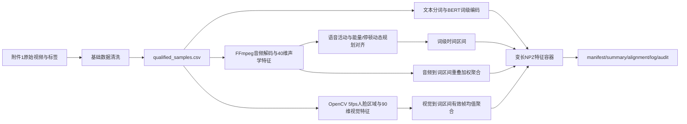

# E题问题一全过程记录：多模态情感特征提取与时序对齐

> 文档版本：v1.3  
> 更新日期：2026-09-24 15:27 CST  
> 适用范围：论文“问题一”章节写作、复现实验说明、方法对比选型、自动审计证据整理  
> 当前状态：数据清洗、三模态基础特征提取、词级时序对齐、全量自动审计、候选方法对比与选型已完成；人工对齐精度真值和增强视觉模型仍需后续补充。

---

## 0. 结论摘要

问题一基于附件1提供的100条原始视频，建立了文本、语音、视觉三模态基础特征提取与词级时序对齐流程。正式处理结果覆盖100/100个样本，输出100个变长NPZ特征文件、100个metadata、100条对齐记录和100条处理日志。

核心结论：

1. 原始样本覆盖完整：样本编号、原始视频、NPZ、metadata和日志均一一对应。
2. 时序组织可核验：各模态均保存序列位置、时间戳和显式有效mask；不使用跨样本padding。
3. 缺失处理明确：零向量不等于有效观测，所有缺失由mask记录。
4. 词级对齐已完成：使用能量、有声概率和频谱通量驱动的单调非重叠动态规划。
5. 对齐不是神经强制对齐器：当前后端为`energy_pause_dp_v1`，论文中不能将其表述为神经forced aligner。
6. 自动审计通过：100/100成功，NaN/Inf为0，词区间异常为0，原始视频SHA-256全部一致。
7. 方法对比已完成：文本选择BERT；语音保留40维完整声学表示；视觉下游推荐去除HOG的54维子集；对齐保留20Hz DP；平滑保留`sigma=0.75`；视觉采样保留5fps。
8. 仍需补充：人工词边界误差真值、主说话人跟踪/头部姿态/表情模型，以及正式论文中的公式化表述。

---

## 1. 任务边界与数据范围

### 1.1 任务目标

对附件1中的每条原始视频，建立统一的词级公共语义时间轴，并完成：

- 文本模态：从原始转写文本提取上下文情感语义表示；
- 语音模态：从音轨提取可解释的声学、韵律和频谱特征；
- 视觉模态：从视频帧提取人脸区域几何、纹理和外观特征；
- 时序对齐：将词序列映射到音频时间区间；
- 词级聚合：将音频帧和视觉帧聚合到每个词区间；
- 缺失表达：用显式mask记录文本、语音和视觉的不可观测位置；
- 结果审计：验证样本覆盖、时序合法性、有限值和原始素材对应关系。

### 1.2 数据范围

- 原始样本：附件1中的100条视频；
- 样本编号格式：`video_id$_$clip_id`；
- 文件键格式：`video_id__clip_id`；
- 视频分组数：37个video_id；
- 每条视频包含1个clip；
- 不训练情感预测模型；
- 不使用附件2、附件3、附件4；
- 不修改、复制或删除原始视频。

### 1.3 关键路径

本地原始数据：

```text
C:\work\数模\中文题目\E题\E题数据\附件1-数据集原始多模态样本\MOSEI数据集部分原始视频-100条
```

本地数据清洗结果：

```text
C:\work\数模\中文题目\E题\artifacts\q1\data_cleaning
```

服务器工作目录：

```text
/data2/hy/cts/e_problem
```

服务器文本特征：

```text
/data2/hy/cts/e_problem/artifacts/q1/text_bert_100
```

服务器最终特征：

```text
/data2/hy/cts/e_problem/artifacts/q1/final_100
```

本地最终特征：

```text
C:\work\数模\中文题目\E题\artifacts\q1\server_final_100\final_100
```

---

## 2. 数据清洗与样本筛选

### 2.1 清洗原则

问题一的数据清洗只检查原始样本是否具备可处理的基本条件，不进行训练，也不把普通缺失位置直接删除。筛选脚本：

```text
C:\work\数模\中文题目\E题\scripts\filter_q1_samples.py
```

清洗规则如下：

| 检查项 | 规则 |
|---|---|
| 必需字段 | `video_id`、`clip_id`、`text`、`label`、`annotation`必须存在 |
| 文本 | 去除首尾空白后必须非空 |
| 视频文件 | 文件必须存在且非空 |
| 媒体流 | 必须同时包含至少一条视频流和一条音频流 |
| 时长 | 时长必须为有限正数 |
| 解码 | 默认对音视频执行完整解码，排除损坏文件 |
| 标签 | `label`必须在`[-3,3]`范围内 |
| 标注 | `annotation`必须为`Negative/Neutral/Positive`，且与标签符号一致 |
| 重复编号 | 重复`sample_id`全部标记为不合格 |
| 原始数据策略 | 只生成清单和报告，不复制、删除或修改原始文件 |

### 2.2 清洗结果

| 指标 | 结果 |
|---|---:|
| 标签表原始行数 | 100 |
| 自动审计样本数 | 100 |
| 合格样本数 | 100 |
| 排除样本数 | 0 |
| 重复sample_id数 | 0 |
| 完整解码检查数 | 100 |
| 视频分组数 | 37 |
| 最短时长 | 2.257秒 |
| 最长时长 | 29.288秒 |
| 平均时长 | 7.875秒 |
| 视频编码 | h264 |
| 音频编码 | aac |
| 原始帧率集合 | 23.976、25、30、29.97 fps |
| 分辨率集合 | 1280x720、640x360、480x360等8种 |

清洗产物：

- `qualified_samples.csv`：后续特征提取只读取该清单；
- `excluded_samples.csv`：被排除样本及原因；
- `all_samples_quality.csv`：100条样本的完整质检明细；
- `quality_report.json`：规则、数量、工具版本和路径记录。

### 2.3 对“模态缺失”的处理边界

本步骤主要检查原始文件是否可读、是否具有音视频流。对于：

- 某个词区间内没有可观测音频帧；
- 某帧基频不可观测；
- 某视频帧未检测到人脸；
- 文本特征某维度不可用；

统一由后续mask表达，不在清洗阶段删除整条样本。

---

## 3. 总体数学对象与处理流程

### 3.1 符号定义

| 符号 | 含义 |
|---|---|
| `i` | 样本编号 |
| `W_i` | 第`i`个样本的词数 |
| `T_i` | 第`i`个样本的音频帧数 |
| `V_i` | 第`i`个样本的视觉采样帧数 |
| `w_{i,j}` | 第`i`个样本的第`j`个词 |
| `I_{i,j}=[s_{i,j},e_{i,j})` | 第`j`个词的半开时间区间 |
| `a_{i,k}` | 第`k`个音频帧的40维特征 |
| `v_{i,l}` | 第`l`个视觉采样帧的90维特征 |
| `x^{text}_{i,j}` | 第`j`个词的768维文本特征 |
| `x^{audio}_{i,j}` | 第`j`个词的40维语音特征 |
| `x^{vision}_{i,j}` | 第`j`个词的90维视觉特征 |
| `m^{modality}` | 对应模态的显式有效mask |

### 3.2 处理流程



处理流程的核心思想是：

1. 文本决定词序列；
2. 音频提供时间活动证据，用于估计词边界；
3. 音频帧和视觉帧通过词区间聚合到同一语义位置；
4. 所有模态的缺失均通过mask保留，而不是静默删除。

---

## 4. 三模态情感特征提取模型

### 4.1 公共词序列

对原始英文转写文本使用如下正则表达式进行词级切分：

```text
[A-Za-z0-9]+(?:['’\-][A-Za-z0-9]+)*
```

得到词序列：

```text
w_{i,1}, w_{i,2}, ..., w_{i,W_i}
```

该序列作为文本、语音和视觉三模态的统一语义索引。每个词均保存：

- 原始词形`word_tokens`；
- 起点`word_start_sec`；
- 终点`word_end_sec`；
- 对齐置信度`word_confidence`；
- 回退标记`word_fallback`。

### 4.2 文本模态：BERT词级上下文表示

#### 4.2.1 方法

使用`bert-base-uncased`对完整转写文本进行编码，不使用情感分类器输出作为特征。BERT的offset mapping将子词映射回原始字符区间，再把与词区间重叠的子词隐状态聚合为词向量。

设词`w_{i,j}`对应的子词索引集合为`S_{i,j}`，BERT最后一层隐状态为`h_{i,p}`，则：

```text
z_{i,j} = (1 / |S_{i,j}|) * sum_{p in S_{i,j}} h_{i,p}
```

随后进行L2归一化：

```text
x^{text}_{i,j} = z_{i,j} / max(||z_{i,j}||_2, epsilon)
```

输出维度：

```text
x^{text}_{i,j} in R^{768}
```

#### 4.2.2 长文本与回退

- 实际100条文本均未触发截断；
- 代码设置了512 token保护；
- 若某词没有匹配到子词，则使用确定性哈希文本特征回退；
- 本次100条样本中BERT文本回退词数为0；
- 文本mask为`text_valid`，形状为`[W,768]`。

#### 4.2.3 论文表述建议

可以写成：

> 文本分支采用预训练BERT提取词级上下文语义表示。与直接使用情感分类器输出不同，该方法保留原始文本的上下文信息，并在词级形成与音频、视觉对齐的共享序列。

不要写成：

> 使用BERT完成了情感分类。

当前BERT只负责基础特征提取，没有进行情感任务微调。

### 4.3 语音模态：40维声学与韵律特征

#### 4.3.1 音频解码与分帧

音频统一解码为：

- 采样率：16000 Hz；
- 声道：单声道；
- 窗长：400点，即25 ms；
- 步长：160点，即10 ms；
- FFT长度：400。

第`k`帧的时间中心为：

```text
t^a_k = (k * H + N / 2) / f_s
```

其中`H=160`，`N=400`，`f_s=16000`。

#### 4.3.2 特征组成

40维语音特征由以下部分组成：

| 特征块 | 维度 | 说明 |
|---|---:|---|
| 对数能量 | 1 | 帧能量`10log10(mean(power)+eps)` |
| 过零率 | 1 | 符号变化比例 |
| 频谱质心 | 1 | 频谱一阶矩 |
| 频谱带宽 | 1 | 频谱二阶中心矩 |
| 85%滚降频率 | 1 | 累积功率达到85%的频率 |
| 频谱平坦度 | 1 | 几何均值与算术均值之比 |
| 频谱通量 | 1 | 相邻帧幅度谱差分的RMS |
| 有声概率 | 1 | 自相关基频检测得到的置信度 |
| 归一化基频 | 1 | 基频除以Nyquist频率 |
| MFCC | 13 | 20个Mel滤波器经DCT得到 |
| MFCC差分 | 10 | 前10维MFCC的一阶差分 |
| log-Mel | 8 | 前8维Mel对数能量 |

总维度：

```text
1+1+1+1+1+1+1+1+1+13+10+8 = 40
```

#### 4.3.3 有效mask

语音有效mask为`audio_valid`，形状为`[T,40]`：

- 某一维度为有限值则对应位置为True；
- 非有限值被置零，但mask保持False；
- 不把不可观测基频当作0 Hz的有效观测；
- 词级聚合时只使用词区间内的有效帧。

### 4.4 视觉模态：90维人脸区域特征

#### 4.4.1 视频采样

- 原始帧率由OpenCV读取；
- 目标采样率固定为5 fps；
- 采样间隔`sample_step=round(native_fps/5)`；
- 视觉时间戳为`frame_index/native_fps`；
- 不直接使用连续全帧率，降低体积和冗余。

#### 4.4.2 人脸检测与ROI

使用OpenCV Haar级联：

```text
haarcascade_frontalface_default.xml
```

参数：

| 参数 | 值 |
|---|---:|
| scaleFactor | 1.1 |
| minNeighbors | 5 |
| minSize | 30x30 |
| 人脸ROI | 48x48 |

若一帧检测到多个人脸，选择面积最大的人脸框。该规则是确定性基线，但不等价于主说话人跟踪。

#### 4.4.3 视觉特征组成

| 特征块 | 维度 | 说明 |
|---|---:|---|
| 人脸框几何 | 8 | 归一化位置、宽高、中心、面积、纵横比 |
| Hu矩 | 7 | 对数尺度Hu矩 |
| 3x3区域均值/标准差 | 18 | ROI局部亮度与对比度 |
| 灰度直方图 | 16 | 归一化灰度分布 |
| HOG | 36 | 2x2网格、每格9方向 |
| Laplacian纹理 | 5 | 均值、标准差、最大值、活跃比例、熵 |

总维度：

```text
8+7+18+16+36+5 = 90
```

#### 4.4.4 检测失败规则

- 检测失败时写入90维零向量；
- 对应`vision_valid=0`；
- 不把检测失败解释为“中性表情”；
- 不把零向量当作真实视觉观测。

#### 4.4.5 当前限制

当前视觉分支是逐帧Haar人脸检测＋人工设计特征，不含：

- 主说话人跟踪；
- 头部姿态估计；
- 人脸关键点；
- 表情识别网络；
- 时序视觉Transformer。

因此论文中应将其表述为“可复现的轻量视觉基线”，不能表述为完整的面部表情识别模型。
---

### 4.5 弱平滑规则

语音和视觉特征均采用轻量高斯平滑，以降低帧级检测和声学估计的随机抖动。

设某模态的连续全维有效区间为`R=[r0,r1]`，平滑结果为：

```text
x_tilde_t = sum_{q in R} G(|t-q|; sigma) x_q / sum_{q in R} G(|t-q|; sigma)
```

实现参数：

- 平滑器：`scipy.ndimage.gaussian_filter1d`；
- `sigma=0.75`；
- `mode=nearest`；
- 仅对长度不少于3的连续全维有效区间平滑；
- 不跨padding、缺失边界或视频边界；
- 平滑不改变mask。

对音频而言，只有所有维度均有效的连续帧段才会整体平滑；对视觉而言，只有连续检测成功的帧段才会平滑。

平滑属于弱平滑，作用是减少高频噪声，不是生成缺失观测，也不改变缺失位置。

---

## 5. 跨模态时序对齐模型

### 5.1 对齐对象

对齐的输入为：

- 词序列`w_{i,1},...,w_{i,W_i}`；
- 音频帧特征和有效mask；
- 有声概率和基频相关标志；
- 音频时长。

对齐输出为每个词的半开时间区间：

```text
I_{i,j} = [s_{i,j}, e_{i,j})
```

并满足：

```text
0 <= s_{i,1} < e_{i,1} <= s_{i,2} < e_{i,2} <= ... <= duration_i
```

即严格单调、非重叠、不超出音频时长。

### 5.2 语音活动分数

对每个音频帧`t`，使用鲁棒分位数归一化：

```text
E_t = clip((energy_t - Q10(energy)) / (Q90(energy) - Q10(energy)), 0, 1)
F_t = clip((flux_t - Q10(flux)) / (Q90(flux) - Q10(flux)), 0, 1)
```

其中：

- `energy_t`为对数能量；
- `flux_t`为频谱通量；
- `Q10/Q90`为该样本能量或通量的10%和90%分位数。

定义语音活动基础分数：

```text
q_t = 0.58 * E_t + 0.27 * V_t + 0.15 * F_t
```

其中`V_t=max(voiced_probability_t, voiced_flag_t)`。

语音活动阈值取：

```text
theta = max(0.24, percentile35(q_t))
```

再得到原始活动标记：

```text
a_raw_t = (q_t >= theta) OR voiced_flag_t OR (E_t >= 0.45)
```

为了减少单帧抖动，对活动标记执行长度为3的形态学闭运算和开运算。最终对齐分数为：

```text
r_t = clip(0.78 * q_t + 0.22 * a_t, 0, 1)
```

对齐工作分辨率为20 Hz。由于音频原始步长为10 ms，因此每5个音频帧聚合为一个对齐工作帧。

### 5.3 词长权重

词`j`的长度权重定义为：

```text
omega_j = 1 + 0.52 * len(clean_token_j) + 0.30 * I[trailing_punctuation_j]
```

其中：

- `clean_token_j`为去除边缘标点后的词；
- `trailing_punctuation_j`表示词后是否紧接标点；
- `I[.]`为指示函数。

该权重使长词和带有句末标点的词获得更合理的持续时间。

### 5.4 动态规划边界选择

设对齐工作序列长度为`T`，候选边界为：

```text
0 = b_0 < b_1 < ... < b_W = T
```

其中`b_j`为第`j`个词的结束边界，同时也是第`j+1`个词的开始边界。

对于词`j`，定义：

```text
L_j = b_j - b_{j-1}
```

活动比例为：

```text
A_j = (P(b_j) - P(b_{j-1})) / max(L_j, 1)
```

其中`P(.)`为活动分数前缀和。

期望长度由词长权重决定：

```text
L_expected_j = omega_j / sum_k omega_k * T
```

持续时间惩罚为：

```text
D_j = -2 * [ln((L_j + 0.5) / (L_expected_j + 0.5))]^2
```

过短惩罚为：

```text
S_j = -2.5 * I[L_j < 1]
```

边界处的停顿奖励为：

```text
R_j = 0.75 * (1 - r_{b_j}) * I[b_j < T]
```

于是动态规划的目标为最大化：

```text
sum_j [3 * A_j + D_j + S_j + R_j]
```

并对起点和终点分别施加候选范围约束。该设计实现了：

- 活动区间奖励；
- 词长适配；
- 过短词惩罚；
- 停顿边界奖励；
- 严格单调和非重叠约束。

### 5.5 对齐边界映射回秒数

工作帧边界`b_j`映射回原始音频帧索引：

```text
b_original_j = round(b_j * group_size)
```

其中`group_size=5`。再映射为秒：

```text
s_j = b_original_{j-1} * 0.01
e_j = b_original_j * 0.01
```

并限制在有效音频时长内。

### 5.6 对齐置信度

对每个词区间计算：

- 活动比例`active_fraction`；
- 边界停顿质量`pause_quality`；
- 时长适配度`duration_fit`。

时长适配度：

```text
duration_fit_j = exp(-|ln((L_j + 0.5) / (L_expected_j + 0.5))|)
```

词级置信度：

```text
confidence_j = clip(
    0.58 * active_fraction_j
    + 0.22 * pause_quality_j
    + 0.20 * duration_fit_j,
    0,
    1
)
```

回退标记：

```text
fallback_j = (active_fraction_j < 0.12) OR (confidence_j < 0.22)
```

回退不等于删除该词；它只表示该词的对齐证据较弱，后续建模可将置信度作为质量权重。

### 5.7 实际对齐结果

| 指标 | 结果 |
|---|---:|
| 样本覆盖 | 100/100 |
| 对齐区间合法率 | 100/100 |
| 平均对齐置信度 | 0.7224 |
| 低置信度词数 | 39 |
| 对齐回退词数 | 39 |
| 词数最小值 | 5 |
| 词数最大值 | 65 |
| 词数均值 | 19.31 |

注意：

- 当前后端为确定性能量/停顿动态规划；
- 它不是神经强制对齐器；
- 在没有人工词边界真值之前，不能声称中位绝对误差≤0.25秒；
- 当前39个低置信度词应在论文中作为异常样本或质量分层依据单独讨论。

---

## 6. 词级聚合模型

### 6.1 音频到词区间

设音频帧`k`的原始时间区间为`J_k=[u_k,u_{k+1})`，其与词区间`I_j=[s_j,e_j)`的重叠长度为：

```text
overlap_{k,j} = max(0, min(e_j, u_{k+1}) - max(s_j, u_k))
```

只选择满足以下条件的帧：

```text
overlap_{k,j} > 0
```

且：

```text
audio_valid_k = all dimensions valid
```

词级音频特征为：

```text
x^{audio}_j =
sum_k overlap_{k,j} * a_k
/
sum_k overlap_{k,j}
```

语音可观测比例为：

```text
observed_ratio_j =
sum_{valid k} overlap_{k,j}
/
sum_k overlap_{k,j}
```

若没有任何有效重叠帧：

- `x^{audio}_j=0`；
- `word_audio_valid_j=0`；
- 不能把零向量视为真实语音观测。

### 6.2 视觉到词区间

设视觉采样时间戳为`t^v_l`，词区间内的视觉帧集合为：

```text
S_j = { l : s_j <= t^v_l < e_j }
```

只对`vision_valid_l=1`的帧聚合：

```text
x^{vision}_j =
(1 / |S_j^valid|) * sum_{l in S_j^valid} v_l
```

视觉可观测比例：

```text
observed_ratio_j =
|S_j^valid| / |S_j|
```

若词区间内没有任何有效视觉帧：

- `x^{vision}_j=0`；
- `word_vision_valid_j=0`；
- 不能把零向量解释为中性表情。

### 6.3 文本到词级

BERT输出已经是词级表示，因此不需要再做时间聚合。每个词对应一个768维向量，文本有效mask为`text_valid`。

---

## 7. 输出文件与时序容器

### 7.1 文件目录

```text
final_100/
├── features/
│   └── <video_id>__<clip_id>.npz
├── metadata/
│   └── <video_id>__<clip_id>.json
├── q1_manifest.csv
├── q1_summary.csv
├── q1_alignment.jsonl
├── q1_processing_log.jsonl
├── feature_dictionary.md
├── pipeline_environment.json
├── quality_audit.json
├── typical_alignment_example.csv
└── typical_alignment_example.png
```

### 7.2 NPZ字段定义

| 字段 | 形状 | 含义 |
|---|---|---|
| `text_features` | `[W,768]` | 词级BERT文本特征 |
| `text_valid` | `[W,768]` | 文本特征有效mask |
| `word_tokens` | `[W]` | 词序列 |
| `audio_features` | `[T,40]` | 音频帧特征 |
| `audio_times` | `[T]` | 音频帧中心时间 |
| `audio_valid` | `[T,40]` | 音频逐维有效mask |
| `vision_features` | `[V,90]` | 5 fps视觉采样特征 |
| `vision_times` | `[V]` | 视觉采样时间戳 |
| `vision_valid` | `[V]` | 视觉帧有效mask |
| `word_audio_features` | `[W,40]` | 词级语音特征 |
| `word_audio_valid` | `[W]` | 词级语音有效性 |
| `word_audio_observed_ratio` | `[W]` | 词区间内语音有效重叠比例 |
| `word_vision_features` | `[W,90]` | 词级视觉特征 |
| `word_vision_valid` | `[W]` | 词级视觉有效性 |
| `word_vision_observed_ratio` | `[W]` | 词区间内视觉有效采样比例 |
| `word_start_sec` | `[W]` | 词起点 |
| `word_end_sec` | `[W]` | 词终点 |
| `word_confidence` | `[W]` | 对齐置信度 |
| `word_fallback` | `[W]` | 对齐回退标记 |

### 7.3 填充与有效长度规则

正式NPZ采用：

> 每个样本独立保存变长数组，不进行跨样本padding。

因此：

- 不需要人为构造统一长度；
- 不同样本的`W/T/V`可以不同；
- 有效长度由mask和summary中的有效帧数直接得到；
- 对不存在的观测写零向量仅用于数组存储，不改变mask；
- 后续模型必须在mask为False的位置停止时间聚合或使用显式缺失门控。

该规则在metadata中记录为：

```text
No cross-sample padding in NPZ; variable-length arrays are retained and all invalid entries are masked.
```

### 7.4 原始素材对应记录

每条样本至少保存：

- `sample_id`；
- `video_id`；
- `clip_id`；
- 原始视频路径；
- 原始视频SHA-256；
- 音频时长；
- 音频帧时间戳；
- 视觉帧时间戳；
- 词级起止秒数；
- 处理日志中的输出路径。

由此可完成：

```text
样本编号 -> 原始视频 -> NPZ -> metadata -> 词区间 -> 音频/视觉时间戳
```

的反向追溯。

---

## 8. 服务器实现与复现实验说明

### 8.1 双环境说明

由于服务器媒体环境缺少`huggingface_hub`，未安装新依赖，采用双环境组合：

| 环境 | Python | 用途 |
|---|---|---|
| `/data2/hy/anaconda3/bin/python` | 3.13.5 | BERT文本特征预计算，CPU推理 |
| `/data2/hy/anaconda3/envs/secgpt-vllm/bin/python` | 3.10.20 | FFmpeg音频、OpenCV视觉、对齐与合并 |

基础环境主要版本：

- PyTorch：2.11.0+cu130；
- Transformers：5.3.0；
- huggingface_hub：1.7.2；
- NumPy：2.2.4；
- SciPy：1.15.2。

媒体环境主要版本：

- NumPy：1.26.4；
- SciPy：1.15.3；
- OpenCV：4.13.0；
- Pillow：9.0.1；
- FFmpeg：4.4.2。

### 8.2 数据同步

服务器原始视频目录：

```text
/data2/hy/cts/e_problem/data/raw_q1
```

该目录下包含100个MP4视频，并保持与附件1相同的目录结构。

### 8.3 文本特征预计算

在服务器根目录执行：

```bash
cd /data2/hy/cts/e_problem

HF_HUB_OFFLINE=1 TRANSFORMERS_OFFLINE=1 \
/data2/hy/anaconda3/bin/python scripts/extract_q1_features.py \
  --csv artifacts/q1/data_cleaning/qualified_samples.csv \
  --raw-root data/raw_q1 \
  --output-dir artifacts/q1/text_bert_100 \
  --text-backend bert \
  --model-name bert-base-uncased \
  --device cpu \
  --text-only
```

该步骤只提取文本特征，不解码音视频。

### 8.4 音视频特征、对齐与合并

在服务器根目录执行：

```bash
cd /data2/hy/cts/e_problem

HF_HUB_OFFLINE=1 TRANSFORMERS_OFFLINE=1 \
/data2/hy/anaconda3/envs/secgpt-vllm/bin/python scripts/extract_q1_features.py \
  --csv artifacts/q1/data_cleaning/qualified_samples.csv \
  --raw-root data/raw_q1 \
  --output-dir artifacts/q1/final_100 \
  --text-backend precomputed \
  --text-feature-dir artifacts/q1/text_bert_100 \
  --smooth-sigma 0.75 \
  --overwrite
```

该步骤会：

1. 读取预计算BERT文本特征；
2. 解码音频并提取40维语音特征；
3. 解码视频并提取90维视觉特征；
4. 执行能量/停顿动态规划对齐；
5. 将音频和视觉聚合到词级；
6. 输出NPZ、metadata、manifest、summary、alignment和processing log。

### 8.5 本地数据清洗复现

本地清洗命令：

```powershell
C:\Users\Admin\anaconda3\python.exe `
  C:\work\数模\中文题目\E题\scripts\filter_q1_samples.py
```

默认输出到：

```text
C:\work\数模\中文题目\E题\artifacts\q1\data_cleaning
```

### 8.6 完整性校验

服务器端：

```bash
cd /data2/hy/cts/e_problem
sha256sum artifacts/q1/final_100.tar.gz
```

当前正式压缩包SHA-256：

```text
c679e23f2ddd79051f9a826b0fbd58b3f24489fa1b5d0279f51ac743aa61b3e3
```

本次审计执行的检查包括：

- 100个NPZ、metadata、alignment、summary和log一一对应；
- 100个原始视频SHA-256与manifest、metadata一致；
- NPZ字段和形状全部匹配；
- 所有数值数组有限；
- 音频、视觉时间戳单调；
- 词区间有序、非重叠且不超出音频时长；
- `q1_alignment.jsonl`与NPZ逐词一致。

### 8.7 复现实验边界

本流程可以在以下条件下复现：

- 已具备附件1原始视频；
- 已具备`bert-base-uncased`本地模型缓存；
- 已具备FFmpeg和OpenCV Haar级联文件；
- 使用记录中的Python环境版本；
- 不使用附件2、附件3或附件4。

如果服务器没有对应模型缓存，需要先准备离线缓存；正式提交包中应明确说明模型获取方式，不能假设网络始终可用。

---

## 9. 实施时间线与关键决策

### 9.1 实际执行顺序

问题一的实施顺序如下：

1. 阅读题目、附件说明和 `ROADMAP.md`，确认问题一仅要求特征提取、时序对齐及可复现证据，不要求训练情感预测器。
2. 对附件1的100条原始视频执行文本、文件、媒体流、解码、标签一致性和重复样本检查。
3. 将合格样本同步到服务器工作目录，并核对样本编号、原始路径和SHA-256。
4. 使用离线BERT缓存预计算词级文本特征。
5. 在媒体环境提取语音、视觉特征，执行词级动态规划对齐，并聚合为词级多模态特征。
6. 生成NPZ、metadata、manifest、summary、alignment、processing log和环境记录。
7. 对100个正式结果执行覆盖、结构、有限值、时间戳、词区间、逐词一致性和原始视频哈希审计。
8. 将正式结果同步回本地，并整理本文档作为论文写作、复现实验和过程留痕材料。

### 9.2 关键决策记录

| 决策点 | 最终选择 | 原因与边界 |
|---|---|---|
| 任务范围 | 只做问题一特征与时序对齐 | 不训练模型，不提前引入问题二、三的预测任务 |
| 数据范围 | 仅附件1的100条原始视频 | 不使用附件2、附件3、附件4 |
| 数据清洗 | 保留文本、视频、音频和标签均合格的样本 | 原始100条全部合格，排除0条；清洗阶段不做特征提取 |
| 文本特征 | `bert-base-uncased`词级768维表示 | 使用offset mapping；无子词映射时确定性回退 |
| 语音特征 | 16 kHz、25 ms窗、10 ms步长、40维特征 | 显式记录逐维有效mask |
| 视觉特征 | 5 fps、Haar人脸ROI、90维轻量特征 | 作为可复现视觉基线，不宣称主说话人跟踪或表情识别 |
| 平滑 | `gaussian_filter1d(sigma=0.75)` | 仅在连续全维有效段内执行，不跨mask边界 |
| 对齐 | `energy_pause_dp_v1`确定性动态规划 | 严格单调、非重叠；不等价于神经强制对齐器 |
| 序列容器 | 变长NPZ，不跨样本padding | 用mask记录缺失；零向量不等于有效观测 |
| 环境 | 双Python环境分工 | 不安装新依赖，复用服务器现有环境与离线缓存 |

---

## 10. 自动审计与结果验证

### 10.1 审计对象

正式审计对象为：

```text
C:\work\数模\中文题目\E题\artifacts\q1\server_final_100\final_100
```

对应的服务器正式目录为：

```text
/data2/hy/cts/e_problem/artifacts/q1/final_100
```

审计以 `q1_manifest.csv`、`q1_summary.csv`、`q1_alignment.jsonl`、`q1_processing_log.jsonl`、100个NPZ和100个metadata为输入，不以早期smoke结果作为正式结论。

### 10.2 覆盖与对应关系

| 检查项 | 结果 | 判定 |
|---|---:|---|
| 原始视频 | 100 | 通过 |
| NPZ特征文件 | 100 | 通过 |
| metadata文件 | 100 | 通过 |
| alignment记录 | 100 | 通过 |
| summary记录 | 100 | 通过 |
| 成功处理日志 | 100 | 通过 |
| 唯一样本ID | 100 | 通过 |
| 原始视频SHA-256唯一值 | 100 | 通过 |
| 原始视频SHA-256一致 | 100/100 | 通过 |
| 错误样本 | 0 | 通过 |

### 10.3 结构与时序合法性

| 检查项 | 结果 | 判定 |
|---|---:|---|
| NPZ字段与主要形状正确 | 100/100 | 通过 |
| NaN数量 | 0 | 通过 |
| Inf数量 | 0 | 通过 |
| 音频时间戳单调 | 100/100 | 通过 |
| 视觉时间戳单调 | 100/100 | 通过 |
| 词区间合法、单调、非重叠 | 100/100 | 通过 |
| `q1_alignment.jsonl`与NPZ逐词一致 | 100/100 | 通过 |
| 对齐区间不超出音频时长 | 100/100 | 通过 |

### 10.4 正式结果统计

| 指标 | 最小值 | 均值 | 最大值 |
|---|---:|---:|---:|
| 词数 | 5 | 19.31 | 65 |
| 音频帧数 | 221 | 775.10 | 2909 |
| 有效音频帧数 | 0 | 392.83 | 1166 |
| 视觉采样数 | 12 | 39.48 | 146 |
| 有效视觉采样数 | 0 | 36.56 | 146 |
| 语音词级可观测率 | 0 | 0.972086 | 1 |
| 视觉词级可观测率 | 0 | 0.909691 | 1 |
| 样本平均对齐置信度 | 0.411853 | 0.722356 | 0.813279 |
| 视觉检测率 | 0 | 0.898553 | 1 |

其他结果：

- 低置信度词总数：39；
- 文本BERT回退词总数：0；
- 语音词级可观测率为0的样本：2；
- 视觉词级可观测率为0的样本：3；
- 语音词级可观测率低于0.8的样本：2；
- 视觉词级可观测率低于0.8的样本：12。

### 10.5 需在论文中单独说明的异常样本

| 样本ID | 有效音频帧 | 有效视觉帧/采样帧 | 说明 |
|---|---:|---:|---|
| `-NFrJFQijFE$_$1` | 285 | 0/29 | 视觉检测全部失败 |
| `-mJ2ud6oKI8$_$1` | 0 | 0/31 | 音频与视觉均不可观测 |
| `-mJ2ud6oKI8$_$2` | 0 | 19/29 | 音频不可观测，视觉部分可用 |
| `-ri04Z7vwnc$_$0` | 230 | 0/14 | 视觉检测全部失败 |

这些样本仍保留在数据集中，因为问题一要求覆盖原始样本并显式记录有效性；不能通过删除异常样本来提高表面完整率。论文应将它们作为缺失模式和质量分层案例讨论。

---

## 11. 官方问题一要求验收对照

### 11.1 原始样本覆盖完整性

| 验收点 | 对应证据 | 文件 | 判定 |
|---|---|---|---|
| 样本编号覆盖 | 100个唯一样本ID，`ok=100` | `q1_manifest.csv`、`q1_summary.csv` | 通过 |
| 模态文件对应 | 每条记录含原始视频路径和解析路径 | `q1_manifest.csv`、metadata | 通过 |
| 输出特征对应 | 100个NPZ与100个样本一一对应 | `features/*.npz` | 通过 |
| 原始素材一致性 | 100个视频SHA-256与manifest、metadata一致 | `q1_manifest.csv`、metadata | 通过 |

### 11.2 时序组织可核验性

| 验收点 | 对应证据 | 文件 | 判定 |
|---|---|---|---|
| 序列位置 | 词序列、音频帧和视觉帧均有索引或顺序 | NPZ、`q1_alignment.jsonl` | 通过 |
| 有效长度 | `*_valid` mask与summary有效帧数 | NPZ、`q1_summary.csv` | 通过 |
| 填充规则 | 不跨样本padding，变长保存 | metadata、`feature_dictionary.md` | 通过 |
| 原始素材对应 | 词起止秒数、音频/视觉时间戳与源视频关联 | NPZ、metadata、alignment | 通过 |
| 时序合法性 | 时间戳单调、词区间有序非重叠 | `quality_audit.json` | 通过 |

### 11.3 方法合理性与可复现性

| 验收点 | 对应证据 | 文件 | 判定 |
|---|---|---|---|
| 特征提取工具 | BERT、FFmpeg、OpenCV、SciPy版本 | `pipeline_environment.json` | 通过 |
| 关键参数 | 窗长、步长、维度、采样率、平滑参数、对齐参数 | `feature_dictionary.md`、本文第4至6章 | 通过 |
| 处理日志 | 100条样本完成事件和输出路径 | `q1_processing_log.jsonl` | 通过 |
| 复现实验说明 | 双环境、数据同步、命令和依赖边界 | 本文第8章 | 通过 |
| 自动审计 | 覆盖、结构、有限值、时序和一致性检查 | `quality_audit.json` | 通过 |

### 11.4 验收结论

从官方问题一的“三项交付要求”看，当前结果已形成完整的工程闭环：

```text
原始视频 -> 数据清洗清单 -> 三模态特征 -> 词级时序对齐
-> 变长时序容器 -> metadata与日志 -> 自动审计 -> 复现说明
```

但“满足交付要求”不等于“完成增强型精度验证”。人工词边界误差、均匀分配基线对比和5/10 fps敏感性实验仍属于下一节所列的增强验收缺口。

---

### 11.4 方法对比实验与最终选型

为满足论文对“模型/优化算法对比分析”的要求，问题一在不训练下游情感预测器的前提下，加入了一组独立的诊断探针实验，用于比较特征表示、对齐策略和平滑参数。实验脚本为`scripts/compare_q1_methods.py`，统计脚本为`scripts/analyze_q1_comparison.py`，完整结果保存在：

```text
C:\work\数模\中文题目\E题\artifacts\q1\comparison\server_all_100_repeat10
/data2/hy/cts/e_problem/artifacts/q1/comparison/all_100_repeat10
```

实验协议：

1. 使用附件1的100条样本和37个`video_id`分组；
2. 使用LogisticRegression与Ridge作为诊断探针，仅用于方法选型，不构成问题一正式模型；
3. 按`video_id`进行重复分组交叉验证，共10次重复；
4. 对候选与当前正式配置做同折配对统计，报告均值差、95%置信区间、胜出次数、配对t检验与Wilcoxon结果，并做Holm多重校正；
5. 硬约束包括区间合法、严格单调、非重叠、有限值和100条样本覆盖。

主要结果：

| 环节 | 候选 | 相对当前方案的结果 | 最终决定 |
|---|---|---|---|
| 文本 | BERT vs Hash | Macro-F1 `+0.0627`，Pearson `+0.2498`，10/10次胜出，校正后显著 | 选择BERT |
| 视觉表示 | `no_hog_54` vs `full_90` | Macro-F1 `+0.0033`（不显著），Pearson `+0.0548`（校正后显著） | 下游推荐`no_hog_54` |
| 视觉表示 | `compact_38` vs `full_90` | Macro-F1 `+0.0310`（显著），Pearson `-0.0328`（不显著） | 保留为分类导向备选 |
| 视觉采样率 | 10fps vs 5fps | Macro-F1 `+0.0136`、Pearson `-0.0136`，均不显著且成本约翻倍 | 保留5fps |
| 对齐 | `full_dp_40` vs `full_dp_20` | Macro-F1 `+0.0046`、Pearson `+0.0053`，未通过Holm校正，耗时约3倍 | 保留`full_dp_20` |
| 对齐 | `length_weighted` vs `full_dp_20` | 时长适配更高，但没有使用能量/停顿结构 | 不替换主对齐器 |
| 平滑 | `sigma=1.0` vs `sigma=0.75` | Macro-F1 `+0.0027`（不显著），Pearson `-0.0008` | 保留`sigma=0.75` |
| 语音 | `energy_voiced_f0_3` vs `full_40` | Macro-F1 `-0.0120`、Pearson `+0.0060`，均不显著；MAE较低但特征覆盖不足 | 保留40维完整表示 |
| 语音 | `core_prosody_9` vs `full_40` | Macro-F1 `+0.0065`（不显著），Pearson `-0.0905`（显著下降） | 不替换 |

最终选型为：BERT文本特征、40维语音完整表示、`no_hog_54`视觉下游视图、5fps采样、20Hz能量/停顿DP对齐和`sigma=0.75`弱平滑。正式NPZ仍保存完整特征超集（文本768维、语音40维、视觉90维）；`no_hog_54`是固定索引`0..48`与`85..89`的确定性切片，不需要重跑原始视频特征，也不改变正式归档哈希。

结论边界：

- 上述诊断探针不能代替问题二的情感预测成绩；
- 重复分组折之间不独立，统计`p`值仅用于选型；
- 视觉线性探针的Pearson仍为负，只能说明简单探针下视觉表示较弱，不能据此断言视觉模态无用；
- `compact_38`可在后续问题二中以分类为主且资源受限时作为消融备选。

---

## 12. Roadmap增强验收缺口

`ROADMAP.md`中的G3增强项比官方问题一最低交付要求更严格。当前文档必须将“已完成”“未完成”和“不适用”分开记录，避免论文过度声称。

| 增强项 | 当前状态 | 现有证据 | 后续实验 |
|---|---|---|---|
| 人工词边界真值 | 未完成 | 无人工标注文件 | 选取样本逐词标注起止时间 |
| 词边界中位绝对误差≤0.25秒 | 未证明 | 无误差真值 | 有真值后计算MAE、Median AE |
| 人工核验P90误差 | 未计算 | 无误差真值 | 计算P90绝对误差与置信区间 |
| 至少10条样本人工/可视复核 | 未完成 | 仅自动审计和示例图 | 抽取至少10条逐词可视复核 |
| 与均匀分配基线比较 | 已完成 | `uniform`、`length_weighted`与DP候选已在100条、10次重复分组探针上比较 | 真实词边界误差仍需人工真值 |
| 5/10 fps对比 | 已完成 | 100条样本、10次重复分组探针；10fps增益不显著且成本更高，保留5fps | 若问题二验证需要更高时间分辨率，再做下游专项消融 |
| 主说话人跟踪 | 未实现 | 当前选最大人脸框 | 多说话人场景需跟踪或说话人分离 |
| 头部姿态/表情模型 | 未实现 | 当前为轻量视觉特征 | 可换用离线姿态或表情模型 |
| 神经强制对齐器 | 未使用 | 当前为`energy_pause_dp_v1` | 若环境允许，增加对齐后端对照实验 |

结论边界：

- 当前可以写“建立了确定性、可复现的词级时序对齐基线”；
- 当前不能写“词边界误差已低于0.25秒”；
- 当前不能写“对齐结果已通过人工精度验证”；
- 当前不能把视觉分支写成主说话人跟踪、头部姿态估计或表情识别模型；
- 上述缺口属于Roadmap增强验收，不应误写为官方问题一未完成。
---

## 13. 论文可用的数学表述

本节给出建议直接转写为论文或LaTeX的紧凑表述。符号与第3至6章保持一致，正式论文中只需选一套定义，避免同一变量重复定义。

### 13.1 样本与公共词序列

设第`i`个原始样本表示为：

```latex
\mathcal{S}_i=(\mathcal{T}_i,\mathcal{A}_i,\mathcal{V}_i),
\quad i=1,\ldots,N,
```

其中`\mathcal{T}_i`、`\mathcal{A}_i`、`\mathcal{V}_i`分别表示文本、语音和视觉模态。对样本`i`构造公共词序列：

```latex
w_{i,1},w_{i,2},\ldots,w_{i,W_i}.
```

第`j`个词对应时间区间：

```latex
I_{i,j}=[s_{i,j},e_{i,j}),\qquad
0\le s_{i,j}<e_{i,j}\le T_i^{a},
```

并满足相邻词严格单调、非重叠：

```latex
e_{i,j}\le s_{i,j+1}.
```

### 13.2 文本模态词级表示

设BERT对词`w_{i,j}`覆盖的子词集合为`\mathcal{C}_{i,j}`，对应子词向量为`\mathbf{u}_{i,c}`，则词级文本特征定义为：

```latex
\mathbf{h}^{T}_{i,j}
=
\frac{1}{|\mathcal{C}_{i,j}|}
\sum_{c\in\mathcal{C}_{i,j}}\mathbf{u}_{i,c},
\qquad
\|\mathbf{h}^{T}_{i,j}\|_2=1.
```

若不存在有效子词映射，则使用确定性哈希向量回退，并记录回退词数。正式100条样本中该回退词数为0。

### 13.3 语音与视觉词级聚合

设音频帧`k`覆盖`J_{i,k}=[u_{i,k},u_{i,k+1})`，其与`I_{i,j}`的重叠长度为：

```latex
o_{i,kj}
=
\max\left(0,\min(e_{i,j},u_{i,k+1})-\max(s_{i,j},u_{i,k})\right).
```

仅对`o_{i,kj}>0`且音频维度全部有效的帧聚合：

```latex
\mathbf{h}^{A}_{i,j}
=
\frac{\sum_{k}o_{i,kj}\mathbf{a}_{i,k}}
{\sum_{k}o_{i,kj}}.
```

设视觉有效采样集合为`\mathcal{V}_{i,j}`，则：

```latex
\mathbf{h}^{V}_{i,j}
=
\frac{1}{|\mathcal{V}_{i,j}|}
\sum_{l\in\mathcal{V}_{i,j}}\mathbf{v}_{i,l}.
```

若某个模态在词区间内不存在有效观测，则特征写零向量，同时令对应`word_*_valid=0`。因此，论文中应区分“数值为零”与“模态可观测”。

### 13.4 时序对齐动态规划

在对齐工作分辨率上，令候选边界为：

```latex
0=b_0<b_1<\cdots<b_{W_i}=T_i.
```

词`j`的长度为`L_j=b_j-b_{j-1}`，活动比例为`A_j`，期望长度为：

```latex
L_j^{exp}
=
\frac{\omega_j}{\sum_{k=1}^{W_i}\omega_k}T_i,
```

其中词长权重为：

```latex
\omega_j
=
1+0.52\,\mathrm{len}(\tilde{w}_j)
+0.30\,\mathbf{1}[\mathrm{punct}_j].
```

最终边界由下述目标函数最大化确定：

```latex
\max_{b_1,\ldots,b_{W_i-1}}
\sum_{j=1}^{W_i}
\left[
3A_j
-2\left(\ln\frac{L_j+0.5}{L_j^{exp}+0.5}\right)^2
-2.5\,\mathbf{1}[L_j<1]
+0.75(1-r_{b_j})\mathbf{1}[b_j<T_i]
\right].
```

该式明确包含活动奖励、时长适配、过短惩罚、停顿边界奖励，以及单调非重叠约束。

### 13.5 对齐置信度

词级对齐置信度可写为：

```latex
c_{i,j}
=
\mathrm{clip}
\left(
0.58A_{i,j}
+0.22P_{i,j}
+0.20D_{i,j},
0,1
\right),
```

其中`A_{i,j}`为活动比例，`P_{i,j}`为边界停顿质量，`D_{i,j}`为时长适配度：

```latex
D_{i,j}
=
\exp\left(
-\left|\ln\frac{L_j+0.5}{L_j^{exp}+0.5}\right|
\right).
```

低置信度标记为：

```latex
\mathrm{fallback}_{i,j}
=
\mathbf{1}[A_{i,j}<0.12\ \lor\ c_{i,j}<0.22].
```

该标记只表示对齐证据弱，不表示删除词，也不等价于人工判定错误。

### 13.6 论文中的模型定位

建议将问题一模型定位为：

> 一个以公共词序列为索引、以显式有效性mask为缺失表达、以确定性动态规划为时序对齐后端、以变长时序容器为输出的多模态基础特征提取与对齐基线。

这一定位与当前实现一致，也避免把基础特征工程表述为端到端情感识别模型。

---

## 14. 论文写作建议与结论边界

### 14.1 建议的论文问题一结构

| 论文小节 | 建议内容 | 主要证据 |
|---|---|---|
| 问题分析 | 说明多模态长度不一、缺失和时序对应问题 | 题目要求、第3章 |
| 数据预处理 | 说明清洗规则、100条合格样本和异常处理 | `quality_report.json` |
| 文本特征 | BERT词级表示、offset mapping、回退规则 | 第4.2节 |
| 语音特征 | 分帧、40维特征和有效mask | 第4.3节 |
| 视觉特征 | 5 fps采样、Haar ROI、90维特征及限制 | 第4.4节 |
| 时序对齐 | 活动分数、词长权重、DP目标、置信度 | 第5章、第13章 |
| 词级聚合 | 音频重叠加权、视觉均值、文本直接映射 | 第6章、第13章 |
| 结果与验证 | 覆盖率、时序合法性、有限值和异常样本 | 第10至11章 |
| 可复现性 | 环境、参数、日志、命令和哈希 | 第8章、第15章 |
| 局限性 | 人工真值、fps敏感性、视觉能力边界 | 第12章、第14.3节 |

### 14.2 可以写入论文的结论

- 对附件1的100条原始视频完成了全覆盖特征提取与词级时序组织；
- 三模态特征均以公共词序列为索引，并保存了显式有效mask；
- 音频和视觉词级聚合均只使用有效观测，缺失位置不被解释为零值语义；
- 弱平滑仅在连续有效区间内执行，不跨缺失边界；
- 当前对齐后端为确定性、可复现的能量/停顿动态规划；
- 100条样本通过覆盖、结构、有限值、时间戳和逐词一致性自动审计。

### 14.3 不应写入论文的结论

| 不应声称 | 原因 |
|---|---|
| 已完成端到端情感识别模型训练 | 问题一未训练预测器 |
| 当前对齐器是神经强制对齐器 | 实际后端为能量/停顿DP |
| 词边界误差已满足0.25秒 | 没有人工词边界真值 |
| 已通过人工对齐精度验证 | 未完成人工复核 |
| 视觉分支实现了主说话人跟踪 | 当前只选最大人脸框 |
| 视觉分支完成头部姿态或表情识别 | 当前只有轻量视觉特征 |
| 零向量表示中性情感 | 零向量只表示存储占位，不代表语义观测 |
| 100条样本没有任何异常 | 自动流程全部成功，但仍有模态局部不可观测样本 |

### 14.4 建议写入的局限性段落

> 本文的问题一结果属于可复现的基础特征与时序对齐基线。词边界由能量、有声概率、频谱通量和停顿线索驱动，不依赖人工词边界标注或神经强制对齐器。视觉分支采用固定频率采样和轻量人脸区域特征，能够提供视觉外观与纹理信息，但不具备主说话人跟踪、头部姿态估计和表情语义识别能力。部分样本存在语音或视觉局部不可观测，本文通过mask和可观测比例显式保留该信息，而未将其填充为语义上的中性值。因此，后续问题二、三在使用这些特征时应继续利用有效mask，并在模型层面处理缺失模态。

---

## 15. 交付文件清单、哈希与复现入口

### 15.1 本地正式目录

| 文件或目录 | 作用 |
|---|---|
| `C:\work\数模\中文题目\E题\docs\问题一_全过程记录.md` | 问题一全过程与论文写作记录 |
| `C:\work\数模\中文题目\E题\scripts\filter_q1_samples.py` | 数据清洗筛选脚本 |
| `C:\work\数模\中文题目\E题\scripts\extract_q1_features.py` | 特征提取、对齐、聚合与审计脚本 |
| `C:\work\数模\中文题目\E题\scripts\compare_q1_methods.py` | 问题一候选特征、对齐、平滑与采样率对比实验 |
| `C:\work\数模\中文题目\E题\scripts\analyze_q1_comparison.py` | 候选—当前方案配对统计、Holm校正与统计报告 |
| `C:\work\数模\中文题目\E题\artifacts\q1\comparison\server_all_100_repeat10` | 全量对比指标、配对统计和最终选型记录 |
| `C:\work\数模\中文题目\E题\artifacts\q1\data_cleaning` | 清洗清单、质检明细和报告 |
| `C:\work\数模\中文题目\E题\artifacts\q1\server_final_100\final_100` | 100条正式特征与审计结果 |

### 15.2 正式结果关键文件SHA-256

| 文件 | SHA-256 |
|---|---|
| `q1_manifest.csv` | `27B79ADC202B6A934220406CA65D15CB7946712819EFDEC4FF1372F9731962A8` |
| `q1_summary.csv` | `B45F314A3321E6926BE4F4812A1D6888B3812BDDA996107C53C23D4C1ED2F63A` |
| `q1_alignment.jsonl` | `47F7612454B1127AFE39F1F564A98665F0853C336AFFAF5AC9199FA83B702BBE` |
| `q1_processing_log.jsonl` | `278BC586478C4E8327FF687B909B2271003B0F757DE09A2A13F6A4C0BE58C4E4` |
| `quality_audit.json` | `198B246EDEA52ED2F530FB90D854A809376DE3E930FFCDAE460262468998129F` |
| `feature_dictionary.md` | `42C089E95095849EF821774A0890DE1F8D6DD7C8B94C70AC87CA9834FA6AC3F3` |
| `pipeline_environment.json` | `3A810A82419A6E80BAA225294CAA6651129608B77929B3B989994F1865561453` |

### 15.3 脚本与清洗文件SHA-256

| 文件 | SHA-256 |
|---|---|
| `filter_q1_samples.py` | `E0F4C71AD6FAB2AC30AB6AAAEDC3C42206369C801B25330C30CDAD3E0F6BDC18` |
| `extract_q1_features.py` | `BA22A4A7BABCAB3B668DA79FDA449D3B7E2EEA322691779180B66D6E8CA0E94A` |
| `qualified_samples.csv` | `08F03D967A02BC3C7D3AC27A738CEFD318583B47D02AFE88BB264F8FC95979D7` |
| `all_samples_quality.csv` | `08F03D967A02BC3C7D3AC27A738CEFD318583B47D02AFE88BB264F8FC95979D7` |
| `quality_report.json` | `A57367AADB81968F5F942AA9422733DF006052FBB16A531379A1B108BE6D5FAB` |
| `compare_q1_methods.py` | `752EE9C218AD2D906106A987202BE5AC87498EDAF130DA86568B6922717A9D17` |
| `analyze_q1_comparison.py` | `929DC3FEB3CE77E6609865BFB5B9F194CF630C41890E3ECF84E2385001CD00D3` |

### 15.4 服务器正式归档

服务器目录：

```text
/data2/hy/cts/e_problem/artifacts/q1/final_100
```

服务器压缩包：

```text
/data2/hy/cts/e_problem/artifacts/q1/final_100.tar.gz
```

压缩包SHA-256：

```text
c679e23f2ddd79051f9a826b0fbd58b3f24489fa1b5d0279f51ac743aa61b3e3
```

### 15.5 复现实验入口

标准复现命令已在本文第8章给出，顺序为：

1. 运行本地清洗脚本生成合格清单；
2. 将附件1原始视频和清洗清单同步到服务器；
3. 在基础环境执行文本特征预计算；
4. 在媒体环境执行音视频特征、对齐、聚合与审计；
5. 使用`sha256sum`核对压缩包；
6. 将正式结果同步回本地后再次检查样本数和关键文件哈希。

复现时不得使用`pipeline_smoke`或早期smoke输出替代`final_100`。论文提交包应同时保留脚本、环境记录、特征字典、处理日志和审计报告；原始视频是否随论文包提交应遵循竞赛提交规范。

### 15.6 方法对比实验关键文件SHA-256

| 文件 | SHA-256 |
|---|---|
| `comparison_metrics.csv` | `DE5008F3390742778D67CB9D0D765C4F09B2975C643EF96DE042482C838C2116` |
| `comparison_summary.json` | `5D61A9946DD506251640EF2F59FD0D3080B06F0E2083FDEDBA00A063E813FD43` |
| `comparison_report.md` | `F005DB68D73FFFFAB874C36B9588C8CD23AA268231A156A1EDF3C3094D2FF51E` |
| `pairwise_statistics.csv` | `4190F5E72434B409CF730FBCA5D67B68BDF687F9C83D4912B241963FEFB202A0` |
| `pairwise_statistics.json` | `1A61669360B92665CEAC4720AA86A274B0AC888FBE757CFBBE24EA6538B3E1C3` |
| `pairwise_statistics.md` | `E57FF1DA1ED43660EDB3B5161E3C36A5F1A8476000E7F42865C85531201E485C` |
| `selection_decision.json` | `41187A63E2ED000F8A1D5012F0AD227AD4C2076A10617B5989B8F7CE0EAD2670` |
| `selection_decision.md` | `A5E2EC34370C66DF20E8468C070934460061550090D47A1721FCDC05E0BA9244` |

---

---

## 16. 后续待补实验清单

| 优先级 | 实验 | 目的 | 验收输出 |
|---|---|---|---|
| P0 | 至少10条样本人工/可视复核 | 检查词边界与模态对应是否符合直觉 | 复核表、截图或时间轴图 |
| P0 | 均匀时长分配基线 | 已用`uniform`与`length_weighted`完成方法选型探针；真实边界增益仍需人工真值 | 人工词边界误差对比 |
| P0 | 人工词边界标注子集 | 建立绝对误差真值 | Median AE、MAE、P90 |
| P1 | 5/10 fps下游消融（可选） | 已在问题一探针中完成，若问题二需要更高时间分辨率再复核 | 下游指标与资源开销对比 |
| P1 | 神经或强制对齐器对照 | 评估当前DP后端的替代空间 | 对齐差异、置信度与运行成本 |
| P1 | 主说话人跟踪或说话人分离 | 改善多人场景视觉对应 | 视觉有效率和语义一致性 |
| P2 | 头部姿态与表情语义模型 | 提升视觉情感表征能力 | 新增视觉特征与消融实验 |
| P2 | 问题二、三的缺失门控模型 | 使用问题一mask进行下游建模 | 下游性能与消融结果 |

边界说明：问题二、三的训练和预测不属于本文档当前问题一的完成范围。上述增强实验完成后，应另建问题二、三记录，避免与问题一交付混写。

---

## 17. 文档维护记录

| 版本 | 日期 | 内容 |
|---|---|---|
| v1.0 | 2026-09-24 14:08 CST | 建立问题一全过程记录，覆盖清洗、特征、对齐、输出和复现 |
| v1.1 | 2026-09-24 14:12 CST | 增加实施时间线、自动审计、官方验收和Roadmap增强缺口 |
| v1.2 | 2026-09-24 14:13 CST | 增加论文公式、写作建议、交付哈希和后续实验清单 |
| v1.3 | 2026-09-24 15:27 CST | 增加100条、10次重复分组的方法对比与配对统计，冻结问题一选型 |

本文档的原则是：

> 只把已经由文件、日志、哈希或统计结果支持的结论写成“已完成”；把没有真值或没有实验支撑的内容明确列为“待补”或“不可声称”。