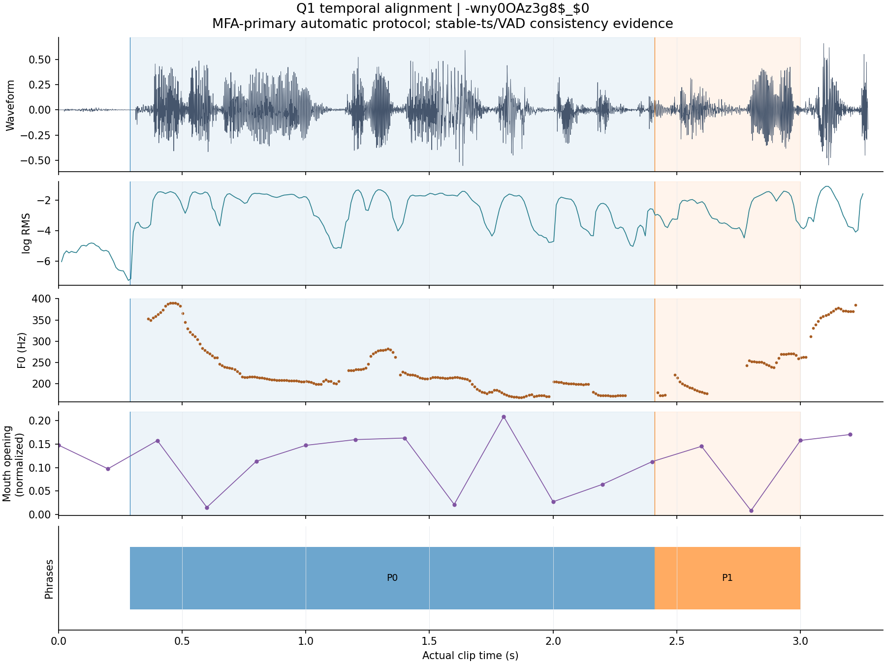
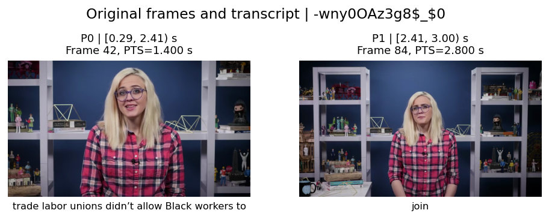
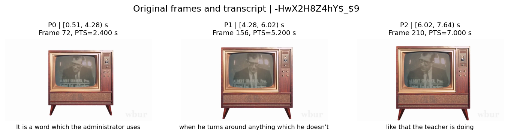

## 典型样本与全部100条结果

本节全部数值由当前CSV、JSONL和NPZ生成。样本ID、序列行、字符范围、声学窗和视频帧之间可双向核验。T/A/V分别表示文本、语音、视觉；每个序列项的维度均为128/16/6，共150维。有效长度P是实际序列项数，文件中不填充；后续组成batch时另设位置掩码。

额外核验对98条非数字静音音轨执行无原文提示的Whisper base.en识别，另2条数字静音明确跳过。389个MFA短语中，273个原词全部精确匹配且ASR时间为正长，得到546个可比端点；分歧中位数0.100秒，P90为0.547秒，最大2.520秒。识别文本相对题给文本的词编辑比为44.241%。这些是词匹配子集上的模型差异，不能外推为全体边界误差；人工真值边界数仍为0。

仍有116个MFA短语未满足独立比较条件，11条非数字静音样本无原词精确匹配；部分识别输出还出现重复句。可能原因包括识别失败、非语音以及题给转写与音轨不一致，单靠该模型不能归因。MFA时间应理解为在题给转写条件下的估计；结构验收通过不消除其语义对应不确定性。原文、源素材和所有未匹配结果完整保留。

[完整核验设计、异常案例及来源说明](边界独立核验与修正说明.md)；全部逐词原始识别随包保留。

### 典型样本：三模态均有观测的既定短先导

样本`-wny0OAz3g8$_$0`，实测时长3.333333秒。原始转写为：

> trade labor unions didn’t allow Black workers to join

下表列出每个短语的原文、实际音频区间、声学窗索引及参与视觉均值的原帧范围。帧区间是最早至最晚采样帧，并非期间所有帧均被聚合；精确列表保留在JSONL。区间均左闭右开，原帧序号从0开始。

| 行 | 原文字符范围与片段 | 音频区间/s | 25ms声学窗索引 | 采样原帧首—末 | 原始PTS首—末/s |
|---:|---|---:|---:|---:|---:|
| P0 | [0,49) `trade labor unions didn’t allow Black workers to ` | [0.290,2.410) | 27—241 | 12—72 | 0.400000—2.400000 |
| P1 | [49,53) `join` | [2.410,3.000) | 239—299 | 78—84 | 2.600000—2.800000 |

三模态代表值如下。BERT第0维仅用于展示数值对应，不赋予单维情绪含义；全部128维语义、16维声学和6维视觉数值见同一NPZ行。掩码列为各模态有效维数。

| 行 | 子词索引 | BERT[0] | MFCC[0] | log-RMS | ZCR | F0/Hz | 嘴开合 | 有效维T/A/V |
|---:|---|---:|---:|---:|---:|---:|---:|---|
| P0 | 0—9 | -0.01881 | -204.49808 | -2.56019 | 0.10065 | 226.41438 | 0.10827 | 128/16/6 |
| P1 | 10—10 | 0.22916 | -205.81018 | -2.65536 | 0.08519 | 226.23430 | 0.07676 | 128/16/6 |

[播放该样本的源音轨副本](../outputs/audit_audio/-wny0OAz3g8$_$0.m4a)。该音频只供回看，没有被登记为人工标注。

无原文提示的Whisper base.en识别结果：` Trade labor unions didn't allow black workers to join and because`。

| 行 | MFA区间/s | 独立ASR同词片段/s | 两端点分歧/s |
|---:|---|---|---|
| P0 | `[0.29, 2.41]` | `[0.0, 2.46]` | `[0.29, 0.05]` |
| P1 | `[2.41, 3.0]` | `[2.46, 2.7]` | `[0.05, 0.3]` |

这一展示验证三模态记录的对应关系，并提供另一模型的语音证据；模型之间接近或分歧都不能直接当作人工测得的真实边界误差。

中等时长先导样本`-HwX2H8Z4hY$_$9`则在全部采样帧中未获得可靠人脸关键点，三个短语的视觉6维均缺失。原帧可见人物出现在画面内的小电视屏幕中；这是检测可用性限制，不等于物理上无人。下图保留其真实帧及相同的原文/时间对应，特征以0加假掩码记录。

### 全量结果表

全部原片段均完整保留、未截断，表中原始有效时长取原容器实测时长，保留六位小数；它描述可回溯的素材时间范围，不代表整个范围均有语音或人脸观测。VAD有效语音区另存JSONL。维度T/A/V为每行维数；缺失维仍占据对应列，靠掩码区分。异常栏记录整段上下文、第二端点缺失、自动合并、视觉缺失和主体歧义；完整细项见JSONL。

“ASR可比/P”是满足原词全部匹配且区间正长的短语数/全部MFA短语数；整段上下文为“—”。该列记录独立证据覆盖，不表示人工准确率。

| # | 样本ID | 模态 | 实测时长/s | 维度T/A/V | P | 对齐粒度 | 一致性等级 | ASR可比/P | 观测/处理状态 |
|---:|---|---|---:|---|---:|---|---|---|---|
| 1 | `-3g5yACwYnA$_$13` | T/A/V | 5.513997 | 128/16/6 | 3 | phrase | C | 3/3 | 已生成 |
| 2 | `-3g5yACwYnA$_$2` | T/A/V | 9.394010 | 128/16/6 | 3 | phrase | C | 1/3 | 已生成 |
| 3 | `-3g5yACwYnA$_$3` | T/A/V | 14.388997 | 128/16/6 | 7 | phrase | C | 7/7 | 已生成 |
| 4 | `-3g5yACwYnA$_$9` | T/A/V | 8.816992 | 128/16/6 | 4 | phrase | C | 4/4 | 已生成 |
| 5 | `-3nNcZdcdvU$_$5` | T/A/V | 7.867969 | 128/16/6 | 3 | phrase | C | 3/3 | 已生成 |
| 6 | `-571d8cVauQ$_$0` | T/A/V | 5.066667 | 128/16/6 | 2 | phrase | B | 1/2 | 已生成 |
| 7 | `-571d8cVauQ$_$5` | T/A/V | 15.272982 | 128/16/6 | 9 | phrase | B | 8/9 | 已生成 |
| 8 | `-6rXp3zJ3kc$_$8` | T/A/V | 12.805013 | 128/16/6 | 6 | phrase | C | 5/6 | 已生成 |
| 9 | `-9y-fZ3swSY$_$0` | T/A/V | 6.833333 | 128/16/6 | 6 | phrase | C | 3/6 | 第二端点缺失；部分视觉缺失 |
| 10 | `-9y-fZ3swSY$_$4` | T/A/V | 2.821029 | 128/16/6 | 2 | phrase | A | 0/2 | 已生成 |
| 11 | `-9y-fZ3swSY$_$8` | T/A/V | 4.988997 | 128/16/6 | 2 | phrase | B | 2/2 | 已生成 |
| 12 | `-AUZQgSxyPQ$_$2` | T/A/V | 22.511003 | 128/16/6 | 11 | phrase | C | 7/11 | 已生成 |
| 13 | `-HeZS2-Prhc$_$2` | T/A/V | 8.261979 | 128/16/6 | 3 | phrase | C | 3/3 | 已生成 |
| 14 | `-HwX2H8Z4hY$_$2` | T/A/V | 3.982031 | 128/16/6 | 2 | phrase | C | 1/2 | 部分视觉缺失 |
| 15 | `-HwX2H8Z4hY$_$5` | T/A/V | 5.652995 | 128/16/6 | 2 | phrase | C | 2/2 | 已生成 |
| 16 | `-HwX2H8Z4hY$_$6` | T/A/V | 3.358008 | 128/16/6 | 2 | phrase | C | 2/2 | 已生成 |
| 17 | `-HwX2H8Z4hY$_$9` | T/A/V | 7.733984 | 128/16/6 | 3 | phrase | C | 2/3 | 全部视觉缺失 |
| 18 | `-I_e4mIh0yE$_$1` | T/A/V | 7.622005 | 128/16/6 | 3 | phrase | A | 3/3 | 已生成 |
| 19 | `-I_e4mIh0yE$_$3` | T/A/V | 9.163021 | 128/16/6 | 4 | phrase | C | 2/4 | 已生成 |
| 20 | `-MeTTeMJBNc$_$0` | T/A/V | 9.300000 | 128/16/6 | 4 | phrase | C | 4/4 | 已生成 |
| 21 | `-MeTTeMJBNc$_$13` | T/A/V | 5.430013 | 128/16/6 | 3 | phrase | C | 3/3 | 第二端点缺失 |
| 22 | `-MeTTeMJBNc$_$7` | T/A/V | 10.516992 | 128/16/6 | 5 | phrase | B | 5/5 | 已生成 |
| 23 | `-NFrJFQijFE$_$1` | T/A/V | 5.746000 | 128/16/6 | 1 | clip_context | C | — | 语音时间不可用；全部视觉缺失 |
| 24 | `-NFrJFQijFE$_$2` | T/A/V | 6.856000 | 128/16/6 | 3 | phrase | C | 0/3 | 第二端点缺失；自动合并；全部视觉缺失 |
| 25 | `-RfYyzHpjk4$_$11` | T/A/V | 5.238997 | 128/16/6 | 3 | phrase | B | 3/3 | 已生成 |
| 26 | `-RfYyzHpjk4$_$2` | T/A/V | 5.516016 | 128/16/6 | 4 | phrase | A | 4/4 | 已生成 |
| 27 | `-RfYyzHpjk4$_$8` | T/A/V | 4.588997 | 128/16/6 | 3 | phrase | C | 2/3 | 自动合并 |
| 28 | `-THoVjtIkeU$_$12` | T/A/V | 14.896029 | 128/16/6 | 10 | phrase | C | 9/10 | 自动合并 |
| 29 | `-THoVjtIkeU$_$2` | T/A/V | 4.291992 | 128/16/6 | 2 | phrase | C | 2/2 | 已生成 |
| 30 | `-THoVjtIkeU$_$6` | T/A/V | 8.097005 | 128/16/6 | 5 | phrase | B | 3/5 | 已生成 |
| 31 | `-UUCSKoHeMA$_$0` | T/A/V | 7.800000 | 128/16/6 | 3 | phrase | B | 3/3 | 已生成 |
| 32 | `-UacrmKiTn4$_$10` | T/A/V | 7.361979 | 128/16/6 | 5 | phrase | C | 5/5 | 已生成 |
| 33 | `-UacrmKiTn4$_$4` | T/A/V | 4.741016 | 128/16/6 | 2 | phrase | B | 2/2 | 已生成 |
| 34 | `-UuX1xuaiiE$_$0` | T/A/V | 3.633333 | 128/16/6 | 2 | phrase | B | 2/2 | 主体歧义 |
| 35 | `-UuX1xuaiiE$_$1` | T/A/V | 10.350000 | 128/16/6 | 4 | phrase | C | 4/4 | 主体歧义 |
| 36 | `-UuX1xuaiiE$_$3` | T/A/V | 4.130013 | 128/16/6 | 2 | phrase | B | 2/2 | 已生成 |
| 37 | `-UuX1xuaiiE$_$6` | T/A/V | 8.113997 | 128/16/6 | 3 | phrase | C | 2/3 | 主体歧义 |
| 38 | `-a55Q6RWvTA$_$3` | T/A/V | 22.153971 | 128/16/6 | 13 | phrase | C | 13/13 | 自动合并 |
| 39 | `-aNfi7CP8vM$_$7` | T/A/V | 8.694987 | 128/16/6 | 3 | phrase | C | 2/3 | 已生成 |
| 40 | `-aqamKhZ1Ec$_$0` | T/A/V | 10.966667 | 128/16/6 | 5 | phrase | C | 5/5 | 第二端点缺失；部分视觉缺失 |
| 41 | `-dxfTGcXJoc$_$0` | T/A/V | 20.500000 | 128/16/6 | 8 | phrase | C | 7/8 | 部分视觉缺失 |
| 42 | `-dxfTGcXJoc$_$1` | T/A/V | 16.161003 | 128/16/6 | 6 | phrase | C | 6/6 | 已生成 |
| 43 | `-dxfTGcXJoc$_$2` | T/A/V | 16.697982 | 128/16/6 | 6 | phrase | C | 6/6 | 已生成 |
| 44 | `-dxfTGcXJoc$_$6` | T/A/V | 12.735026 | 128/16/6 | 4 | phrase | B | 4/4 | 已生成 |
| 45 | `-egA8-b7-3M$_$1` | T/A/V | 10.266016 | 128/16/6 | 5 | phrase | C | 5/5 | 已生成 |
| 46 | `-egA8-b7-3M$_$13` | T/A/V | 4.183984 | 128/16/6 | 2 | phrase | B | 2/2 | 已生成 |
| 47 | `-egA8-b7-3M$_$16` | T/A/V | 5.538021 | 128/16/6 | 3 | phrase | B | 3/3 | 已生成 |
| 48 | `-egA8-b7-3M$_$17` | T/A/V | 7.271029 | 128/16/6 | 3 | phrase | A | 3/3 | 已生成 |
| 49 | `-egA8-b7-3M$_$18` | T/A/V | 8.386003 | 128/16/6 | 4 | phrase | B | 4/4 | 已生成 |
| 50 | `-egA8-b7-3M$_$20` | T/A/V | 6.644987 | 128/16/6 | 3 | phrase | C | 3/3 | 已生成 |
| 51 | `-egA8-b7-3M$_$26` | T/A/V | 6.030990 | 128/16/6 | 3 | phrase | A | 3/3 | 已生成 |
| 52 | `-egA8-b7-3M$_$6` | T/A/V | 6.264974 | 128/16/6 | 2 | phrase | B | 2/2 | 已生成 |
| 53 | `-egA8-b7-3M$_$9` | T/A/V | 5.089974 | 128/16/6 | 3 | phrase | C | 3/3 | 已生成 |
| 54 | `-hnBHBN8p5A$_$6` | T/A/V | 6.401000 | 128/16/6 | 4 | phrase | C | 0/4 | 第二端点缺失；部分视觉缺失 |
| 55 | `-hnBHBN8p5A$_$7` | T/A/V | 7.372000 | 128/16/6 | 5 | phrase | C | 0/5 | 第二端点缺失；部分视觉缺失 |
| 56 | `-iRBcNs9oI8$_$3` | T/A/V | 5.621000 | 128/16/6 | 3 | phrase | C | 0/3 | 已生成 |
| 57 | `-iRBcNs9oI8$_$6` | T/A/V | 2.903000 | 128/16/6 | 1 | phrase | A | 0/1 | 已生成 |
| 58 | `-iRBcNs9oI8$_$7` | T/A/V | 4.104000 | 128/16/6 | 4 | phrase | C | 0/4 | 第二端点缺失 |
| 59 | `-iRBcNs9oI8$_$8` | T/A/V | 8.093000 | 128/16/6 | 6 | phrase | C | 0/6 | 第二端点缺失 |
| 60 | `-iRBcNs9oI8$_$9` | T/A/V | 3.416000 | 128/16/6 | 1 | phrase | C | 0/1 | 已生成 |
| 61 | `-lzEya4AM_4$_$5` | T/A/V | 7.675000 | 128/16/6 | 4 | phrase | C | 3/4 | 已生成 |
| 62 | `-lzEya4AM_4$_$6` | T/A/V | 14.791992 | 128/16/6 | 8 | phrase | B | 7/8 | 自动合并 |
| 63 | `-mJ2ud6oKI8$_$1` | T/A/V | 6.103000 | 128/16/6 | 1 | clip_context | M | — | 音频缺失；全部视觉缺失 |
| 64 | `-mJ2ud6oKI8$_$2` | T/A/V | 5.731000 | 128/16/6 | 1 | clip_context | M | — | 音频缺失；全部视觉缺失 |
| 65 | `-mJ2ud6oKI8$_$6` | T/A/V | 2.257000 | 128/16/6 | 2 | phrase | C | 0/2 | 已生成 |
| 66 | `-mJ2ud6oKI8$_$8` | T/A/V | 4.192000 | 128/16/6 | 2 | phrase | C | 0/2 | 已生成 |
| 67 | `-mJ2ud6oKI8$_$9` | T/A/V | 7.033000 | 128/16/6 | 5 | phrase | C | 0/5 | 已生成 |
| 68 | `-mqbVkbCndg$_$0` | T/A/V | 6.466667 | 128/16/6 | 5 | phrase | C | 5/5 | 第二端点缺失 |
| 69 | `-qDkUB0GgYY$_$6` | T/A/V | 4.677995 | 128/16/6 | 2 | phrase | B | 2/2 | 已生成 |
| 70 | `-ri04Z7vwnc$_$0` | T/A/V | 2.807000 | 128/16/6 | 1 | phrase | C | 0/1 | 全部视觉缺失 |
| 71 | `-ri04Z7vwnc$_$2` | T/A/V | 6.027000 | 128/16/6 | 3 | phrase | C | 0/3 | 第二端点缺失；部分视觉缺失 |
| 72 | `-ri04Z7vwnc$_$5` | T/A/V | 3.545000 | 128/16/6 | 3 | phrase | C | 0/3 | 第二端点缺失 |
| 73 | `-s9qJ7ATP7w$_$0` | T/A/V | 6.800000 | 128/16/6 | 5 | phrase | C | 3/5 | 已生成 |
| 74 | `-s9qJ7ATP7w$_$1` | T/A/V | 4.791992 | 128/16/6 | 2 | phrase | C | 1/2 | 已生成 |
| 75 | `-s9qJ7ATP7w$_$4` | T/A/V | 4.427018 | 128/16/6 | 2 | phrase | C | 2/2 | 已生成 |
| 76 | `-s9qJ7ATP7w$_$5` | T/A/V | 8.561003 | 128/16/6 | 4 | phrase | C | 4/4 | 已生成 |
| 77 | `-s9qJ7ATP7w$_$6` | T/A/V | 2.475000 | 128/16/6 | 2 | phrase | B | 2/2 | 已生成 |
| 78 | `-s9qJ7ATP7w$_$7` | T/A/V | 6.966016 | 128/16/6 | 5 | phrase | C | 4/5 | 部分视觉缺失 |
| 79 | `-s9qJ7ATP7w$_$8` | T/A/V | 3.294987 | 128/16/6 | 3 | phrase | B | 3/3 | 已生成 |
| 80 | `-t217m2on-s$_$2` | T/A/V | 5.686003 | 128/16/6 | 2 | phrase | C | 2/2 | 已生成 |
| 81 | `-t217m2on-s$_$7` | T/A/V | 17.183008 | 128/16/6 | 8 | phrase | B | 7/8 | 自动合并 |
| 82 | `-tANM6ETl_M$_$3` | T/A/V | 6.758008 | 128/16/6 | 4 | phrase | B | 3/4 | 已生成 |
| 83 | `-tPCytz4rww$_$10` | T/A/V | 4.788997 | 128/16/6 | 2 | phrase | B | 1/2 | 已生成 |
| 84 | `-tPCytz4rww$_$11` | T/A/V | 5.466992 | 128/16/6 | 3 | phrase | B | 0/3 | 已生成 |
| 85 | `-tPCytz4rww$_$12` | T/A/V | 11.863997 | 128/16/6 | 5 | phrase | C | 3/5 | 已生成 |
| 86 | `-tPCytz4rww$_$16` | T/A/V | 7.205990 | 128/16/6 | 3 | phrase | C | 1/3 | 已生成 |
| 87 | `-tPCytz4rww$_$18` | T/A/V | 6.644987 | 128/16/6 | 3 | phrase | A | 3/3 | 已生成 |
| 88 | `-uywlfIYOS8$_$4` | T/A/V | 6.044987 | 128/16/6 | 3 | phrase | C | 3/3 | 已生成 |
| 89 | `-vxjVxOeScU$_$4` | T/A/V | 9.127018 | 128/16/6 | 4 | phrase | C | 4/4 | 已生成 |
| 90 | `-wMB_hJL-3o$_$7` | T/A/V | 6.044010 | 128/16/6 | 3 | phrase | B | 3/3 | 已生成 |
| 91 | `-wny0OAz3g8$_$0` | T/A/V | 3.333333 | 128/16/6 | 2 | phrase | B | 2/2 | 已生成 |
| 92 | `-wny0OAz3g8$_$1` | T/A/V | 6.844010 | 128/16/6 | 3 | phrase | B | 3/3 | 已生成 |
| 93 | `-wny0OAz3g8$_$2` | T/A/V | 6.686979 | 128/16/6 | 4 | phrase | B | 4/4 | 已生成 |
| 94 | `-wny0OAz3g8$_$3` | T/A/V | 6.146029 | 128/16/6 | 3 | phrase | B | 3/3 | 已生成 |
| 95 | `-wny0OAz3g8$_$5` | T/A/V | 6.911979 | 128/16/6 | 4 | phrase | B | 2/4 | 已生成 |
| 96 | `-wny0OAz3g8$_$7` | T/A/V | 8.067969 | 128/16/6 | 4 | phrase | A | 3/4 | 已生成 |
| 97 | `-wny0OAz3g8$_$9` | T/A/V | 6.213021 | 128/16/6 | 5 | phrase | B | 5/5 | 已生成 |
| 98 | `-yRb-Jum7EQ$_$1` | T/A/V | 29.288021 | 128/16/6 | 16 | phrase | C | 0/16 | 第二端点缺失；主体歧义 |
| 99 | `-yRb-Jum7EQ$_$5` | T/A/V | 13.169010 | 128/16/6 | 6 | phrase | C | 0/6 | 第二端点缺失 |
| 100 | `-yRb-Jum7EQ$_$6` | T/A/V | 11.241995 | 128/16/6 | 7 | phrase | C | 0/7 | 第二端点缺失 |

全部100行均通过当前结构验证和自动验收。等级与有效掩码描述不同的对象：等级反映对齐器一致性，有效掩码描述对应特征是否有可用观测。
